<div align="center">

# ⚡ SwiftRoute

### Last-Mile Delivery Tracker

**A delivery management platform with an explainable pricing engine, intelligent agent dispatch, immutable tracking history and multi-channel customer notifications.**

[](https://github.com/Shanmuk4622/Unthinkable-LastMile-Delivery-Track-assignment/actions/workflows/ci.yml)


[Quick start](#-quick-start) · [Rate engine](#-the-rate-calculation-engine) · [Dispatch](#-the-auto-assignment-engine) · [API](docs/API.md) · [System design](docs/SYSTEM_DESIGN.md)

</div>

---

## Table of contents

| | Section | |
|---|---|---|
| 1 | [What this is](#-what-this-is) | The problem and the shape of the solution |
| 2 | [Quick start](#-quick-start) | Running in about 60 seconds |
| 3 | [Demo accounts](#-demo-accounts) | Three seeded personas |
| 4 | [Architecture](#-architecture) | How the pieces fit together |
| 5 | [The rate calculation engine](#-the-rate-calculation-engine) | Eight steps, zero magic numbers |
| 6 | [Zone detection](#-zone-detection) | Pincode → area → zone |
| 7 | [The auto-assignment engine](#-the-auto-assignment-engine) | Weighted nearest-available-agent |
| 8 | [Order lifecycle](#-order-lifecycle) | The state machine |
| 9 | [Failed delivery & reschedule](#-failed-delivery--reschedule) | The recovery loop |
| 10 | [Immutable tracking history](#-immutable-tracking-history) | Who, what, when, why |
| 11 | [Notifications](#-notifications) | E-mail + SMS through an outbox |
| 12 | [Database schema](#-database-schema) | 13 tables |
| 13 | [The interface](#-the-interface) | Three role-scoped experiences |
| 14 | [API reference](#-api-reference) | Every endpoint |
| 15 | [Configuration](#-configuration) | Every environment variable |
| 16 | [Testing](#-testing) | 88 cases |
| 17 | [Deployment](#-deployment) | Render, Docker, anywhere |
| 18 | [Project structure](#-project-structure) | Where everything lives |
| 19 | [Documentation index](#-documentation-index) | The full set |

---

## 🎯 What this is

Logistics operations are a knot of three hard problems that most delivery apps
wave away:

| The hard bit | The lazy answer | What SwiftRoute does |
|---|---|---|
| **Pricing** | A flat rate, or a `if (weight > 5)` ladder buried in a controller | A rate engine driven entirely by admin-editable tables — zone pair, volumetric weight, B2B/B2C card, COD surcharge — that returns the arithmetic behind every rupee |
| **Dispatch** | Assign to whoever is nearest, or round-robin | Four normalised signals (proximity, zone familiarity, current workload, delivery record) scored together, with the full ranked shortlist persisted for audit |
| **Trust** | A `status` column you can `UPDATE` | An append-only tracking table with no update or delete path anywhere in the API, recording who changed what, when and why |

Everything else — auth, notifications, the reschedule loop, the admin console —
exists to make those three usable by real people.

### At a glance

```
   3 personas          10 lifecycle states       13 database tables
   6 seeded zones      25 serviceable pincodes   6 rate cards
   50+ API endpoints   88 passing tests          ~20 screens
```

---

## 🚀 Quick start

> **Prerequisites:** Node 20+ and npm 10+. Nothing else — no Docker, no
> database server, no API keys.

```bash
git clone https://github.com/Shanmuk4622/Unthinkable-LastMile-Delivery-Track-assignment.git
cd Unthinkable-LastMile-Delivery-Track-assignment
cp .env.example .env
npm run setup
npm run dev
```

That is the whole thing. `npm run setup` installs both workspaces, generates the
Prisma client, creates a SQLite database and seeds it with six zones, 25
pincodes, six rate cards, 13 accounts and a fortnight of orders across every
status.

| | |
|---|---|
| 🖥️ **Client** | http://localhost:5173 |
| 🔌 **API** | http://localhost:4000/api |
| ❤️ **Health** | http://localhost:4000/api/health |
| 🗄️ **Prisma Studio** | `npm run db:studio` |

### Every script

| Command | What it does |
|---|---|
| `npm run dev` | API (`:4000`) and client (`:5173`) together, both hot-reloading |
| `npm run setup` | Install → generate client → create schema → seed |
| `npm run build` | Compile the API and build the client into `server/public` |
| `npm start` | Run the compiled single-service build |
| `npm test` | The full test suite |
| `npm run db:seed` | Seed (idempotent — safe to re-run) |
| `npm run db:reset` | Wipe and re-seed |
| `npm run db:studio` | Browse the database in a GUI |
| `npm run typecheck` | Typecheck both workspaces |

---

## 👥 Demo accounts

The landing page has one-click sign-in for all three. Credentials are also
copy-to-clipboard buttons there.

| Role | E-mail | Password | What you can do |
|---|---|---|---|
| 🛡️ **Admin** | `admin@swiftroute.dev` | `Admin@123` | Everything: zones, rate cards, dispatch, status overrides |
| 📦 **Customer** | `customer@swiftroute.dev` | `Demo@123` | Book a pickup, watch the price build live, track, reschedule |
| 🚚 **Agent** | `agent@swiftroute.dev` | `Demo@123` | Run the delivery ladder, report a failure, share GPS |

> Five more customers and five more agents exist — see
> [`server/src/seed/fixtures.ts`](server/src/seed/fixtures.ts).

### A five-minute tour

1. Sign in as **customer** → **Book a pickup** → type pincode `560034` and
   `500034`, box `30 × 20 × 15`, weight `1.2`. Watch the right-hand panel price
   it live, detect both zones and explain which weight won.
2. Switch **Payment** to **Cash on delivery**, enter a declared value, and see
   the COD surcharge line appear with its formula.
3. Confirm. The dispatcher assigns the nearest available agent immediately.
4. Sign in as **admin** → open the order → the **Dispatch engine** panel shows
   every candidate's four signals and why the others were filtered out.
5. Sign in as **agent** → advance the order to *Out for delivery* → report a
   **failed attempt**.
6. Back as **customer** → **Reschedule** → note that a *different* agent picks
   it up.
7. As **admin** → **Notification outbox** → read the actual e-mails that were
   generated at each step.

---

## 🏗 Architecture

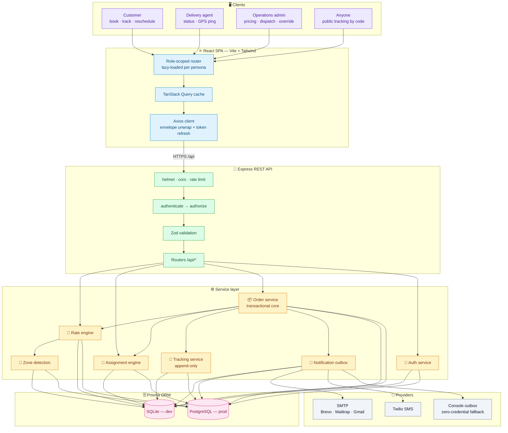

### Request flow

Every write funnels through one path, so the four things that must happen
together cannot drift apart:

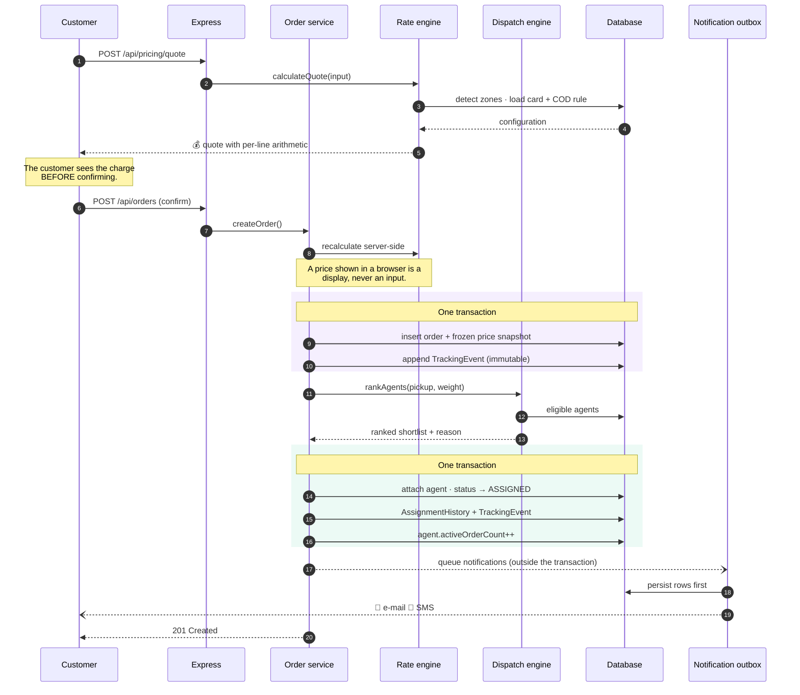

> **Why notifications sit outside the transaction:** a slow mail server must
> never be able to roll back a delivery. The rows are written first, so nothing
> is lost if a provider is down — a failed message keeps its provider error and
> can be retried from the admin console.

---

## 🧮 The rate calculation engine

> 📄 Full write-up with more worked examples: **[docs/RATE_ENGINE.md](docs/RATE_ENGINE.md)**
> · Source: [`server/src/services/rateEngine.ts`](server/src/services/rateEngine.ts)

**There is not a single hardcoded number in the pricing path.** Divisors, slab
sizes, prices, surcharge percentages and COD rules all come from database tables
an administrator edits in the UI.

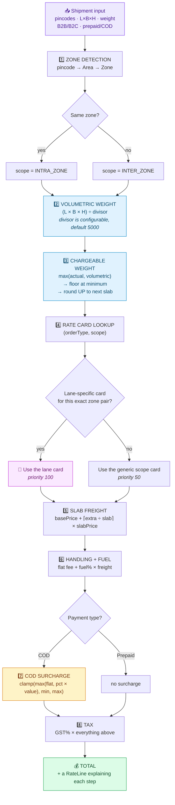

### Worked example

A 30 × 20 × 15 cm parcel weighing 1.2 kg, Koramangala (`560034`) →
Jayanagar (`560011`), B2C, cash on delivery on ₹4,500 of goods.

| Step | Calculation | Result |
|---|---|---|
| **Zone detection** | `560034` → BLR-S · `560011` → BLR-S | 🟢 `INTRA_ZONE` |
| **Volumetric weight** | `30 × 20 × 15 ÷ 5000` = `9000 ÷ 5000` | `1.80 kg` |
| **Actual weight** | given | `1.20 kg` |
| **Which wins?** | `max(1.20, 1.80)` | 🔵 **volumetric** — the parcel is bulky for its weight |
| **Slab rounding** | `1.80` → next `0.5 kg` slab | **`2.00 kg` chargeable** |
| **Rate card** | B2C · intra-zone, no lane override | *B2C Local — standard* |
| **Base freight** | covers the first `0.5 kg` | `₹49.00` |
| **Extra weight** | `⌈(2.0 − 0.5) ÷ 0.5⌉ = 3` slabs `× ₹22` | `₹66.00` |
| **Fuel surcharge** | `6% × ₹115.00` freight | `₹6.90` |
| **COD surcharge** | `max(₹40 flat, 1.5% × ₹4,500 = ₹67.50)`, clamped to ₹40–500 | `₹67.50` |
| **Taxable value** | `115.00 + 6.90 + 67.50` | `₹189.40` |
| **GST** | `18% × ₹189.40` | `₹34.09` |
| | | |
| 💰 **Total** | | **`₹223.49`** |

This exact example is asserted in
[`rateEngine.test.ts`](server/src/services/rateEngine.test.ts) and in the API
integration suite, and is reproduced in the UI on the landing page and in every
order's price breakdown.

### The three subtleties that matter

<details>
<summary><b>1. Why the higher of actual and volumetric weight?</b></summary>

A van has two scarce resources: payload and space. A dense parcel consumes the
first, a bulky one the second. Billing only on the scale means a metre-cube of
polystyrene travels almost free while stealing the space of twenty paying
parcels. The dimensional divisor converts space into an equivalent weight so
both are charged. `5000` is the IATA/courier standard for road and air express;
lowering it to `4000` bills bulky freight harder, and an admin can do that from
**Pricing → Weight settings** without a deploy.
</details>

<details>
<summary><b>2. Why <code>max()</code> and not <code>sum()</code> for the COD surcharge?</b></summary>

The flat fee and the percentage are two different risk models. The flat fee is a
floor that makes collecting ₹200 in cash worth the paperwork. The percentage
takes over once the cash a rider is carrying becomes a real theft and
reconciliation risk. Adding them would double-charge the middle of the range —
which is why carriers take the maximum and then clamp it into a published band.
</details>

<details>
<summary><b>3. Why the price is recalculated on confirm, then frozen</b></summary>

The quote the browser shows is a *display*, never an input — trusting it would
let anyone POST their own price. So `createOrder` recomputes from scratch
server-side. The result is then serialised onto the order row, which means
editing a rate card tomorrow changes tomorrow's quotes and **cannot restate
yesterday's invoice**. Rate cards that have priced real orders are archived
rather than deleted for the same reason.
</details>

---

## 📍 Zone detection

> Source: [`server/src/services/zoneService.ts`](server/src/services/zoneService.ts)

"Detect the pickup and drop zone" is really a question about **serviceability**:
which operational region owns this address? SwiftRoute answers it with a
**pincode → area → zone** lookup table that an admin owns completely.

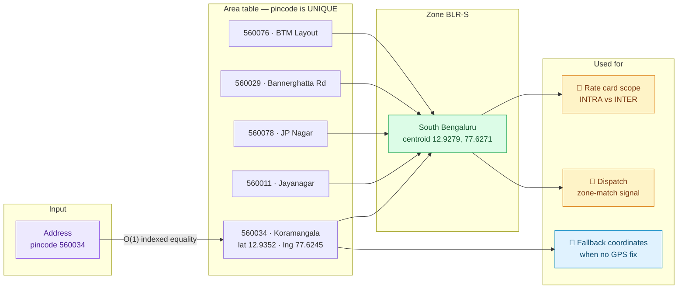

**Why a lookup table rather than geometry?**

| | Lookup table ✅ | Polygon / PostGIS |
|---|---|---|
| Matches how 3PLs actually publish coverage | ✅ serviceable-pincode lists | ❌ nobody ships polygons |
| Detection cost | `O(1)` indexed equality | point-in-polygon test |
| Runs on SQLite *and* PostgreSQL | ✅ identical code | ❌ needs a spatial extension |
| Onboarding a new locality | a dropdown in the admin UI | a GIS tool |
| Handles a pincode split across zones | ❌ needs a sub-area rule | ✅ naturally |

Coordinates are still carried on every area and zone, but they are **not** used
for detection — they feed the distance maths in the dispatcher when an address
arrives without a precise GPS fix. The migration path to polygons is written up
in [docs/RATE_ENGINE.md](docs/RATE_ENGINE.md#evolving-zone-detection).

Unmapped pincodes fail loudly and actionably rather than guessing:

```json
{
  "success": false,
  "error": {
    "code": "ZONE_NOT_SERVICEABLE",
    "message": "Pincode 999999 is not mapped to a delivery zone yet. An admin can add it under Zones -> Areas.",
    "details": { "pincode": "999999" }
  }
}
```

---

## 🎯 The auto-assignment engine

> 📄 Full write-up: **[docs/AUTO_ASSIGNMENT.md](docs/AUTO_ASSIGNMENT.md)**
> · Source: [`server/src/services/assignmentEngine.ts`](server/src/services/assignmentEngine.ts)

Dispatch is a **ranking** problem, not a lookup. "Nearest" alone produces a
dispatcher that hands six parcels to the one rider standing outside the
warehouse while an idle rider two kilometres away does nothing.

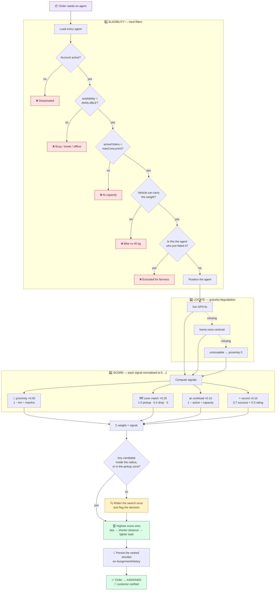

### The scoring formula

$$\text{score} = \sum_{i} w_i \cdot s_i \quad \text{where} \quad \sum_i w_i = 1$$

| Signal | Default weight | Formula | Why it is in there |
|---|---:|---|---|
| 📏 **Proximity** | `0.50` | `max(0, 1 − distanceKm / ASSIGN_MAX_DISTANCE_KM)` | The dominant cost of a pickup is getting there |
| 🗺️ **Zone match** | `0.25` | `1.0` pickup zone · `0.4` drop zone · `0` otherwise | Agents know their own zone's lifts, one-ways and security desks |
| 📊 **Workload** | `0.15` | `1 − activeOrders / maxConcurrentOrders` | Stops a hot agent being buried while others idle |
| ⭐ **Performance** | `0.10` | `0.7 × successRate + 0.3 × (rating / 5)` | Rewards reliability; new agents get a neutral `0.8`, not a cold-start penalty |

All four weights are `.env` variables and are **re-normalised to sum to 1**, so
an operator can type any ratios they like and the score stays in `[0, 1]`.

### Made visible, not magic

Every automatic decision persists its full ranked shortlist, and the admin UI
renders exactly that table — the four signal bars, the distance, the ETA, the
current load, and a collapsible list of who was filtered out *and why*:

```
┌────────────────────────────────────────────────────────────────────┐
│ 👑 Kiran Kumar        BLR-S · bike · 0.0 km · ~8 min · 1/5   0.966 │
│    proximity 1.00 ▓▓▓▓▓▓▓▓  zone 1.00 ▓▓▓▓▓▓▓▓                     │
│    capacity  0.80 ▓▓▓▓▓▓░░  record 0.94 ▓▓▓▓▓▓▓░           [Assign]│
├────────────────────────────────────────────────────────────────────┤
│ 2  Deepa Nair         BLR-C · scooter · 6.3 km · ~25 min · 4/6 0.547│
├────────────────────────────────────────────────────────────────────┤
│ 3  Lakshmi Prasad     BLR-N · bike · 15.1 km · ~49 min · 2/5  0.385│
└────────────────────────────────────────────────────────────────────┘
  ▸ 2 agents filtered out
      Sameer Khan   —  At capacity (8/8 active orders)
      Nisha Rane    —  Not available (on break)
```

An admin can accept the engine's pick with one click, or override it by choosing
any other eligible agent from the same table. `GET /api/orders/:id/assignment-preview`
returns this without changing anything, so "who *would* get this?" is a safe question.

---

## 🔄 Order lifecycle

> Source: [`server/src/domain/orderStateMachine.ts`](server/src/domain/orderStateMachine.ts)

Every status change in the system funnels through `assertTransition`, so the set
of legal edges lives in exactly one place.

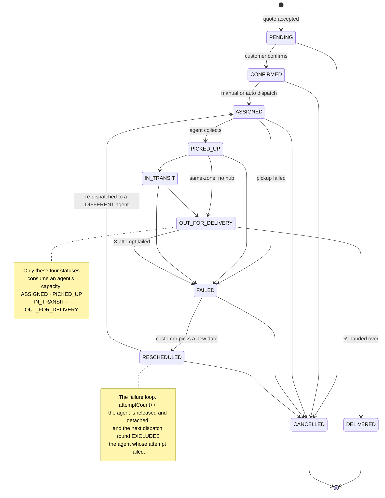

### Who may request what

| Status | 📦 Customer | 🚚 Agent | 🛡️ Admin |
|---|:---:|:---:|:---:|
| `CONFIRMED` | ✅ | — | ✅ |
| `ASSIGNED` | — | — | ✅ (via dispatch) |
| `PICKED_UP` | — | ✅ | ✅ |
| `IN_TRANSIT` | — | ✅ | ✅ |
| `OUT_FOR_DELIVERY` | — | ✅ | ✅ |
| `DELIVERED` | — | ✅ | ✅ |
| `FAILED` | — | ✅ *(reason required)* | ✅ |
| `RESCHEDULED` | ✅ | — | ✅ |
| `CANCELLED` | ✅ *(before pickup)* | — | ✅ |

Agents may only move orders **assigned to them**. Admins additionally get an
`override` flag that bypasses the transition graph — the brief requires
"override any order status" — and the override is recorded **on the tracking
event**, so an auditor can always tell a normal transition from a manual
intervention.

### Agent capacity accounting

Capacity bookkeeping is automatic, which is what stops the dispatcher handing
work to someone who is already full:

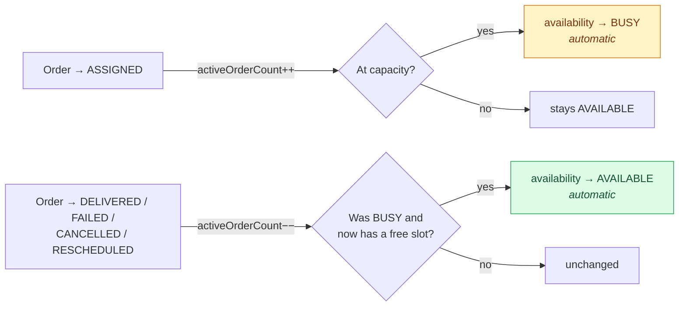

Going offline is refused while orders are still in hand — otherwise parcels
would sit in `ASSIGNED` with nobody accountable for them.

---

## 🔁 Failed delivery & reschedule

This is the loop the brief singles out, and it is implemented end to end.

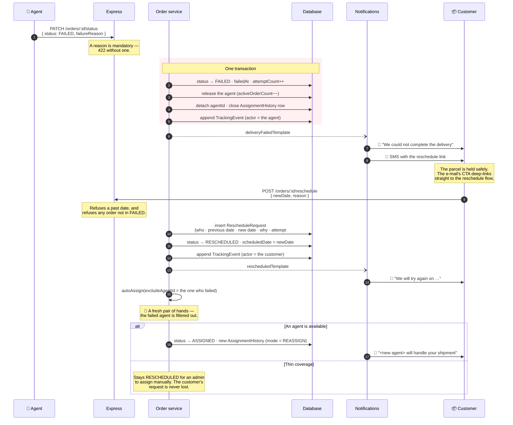

Verified end to end — here is the resulting immutable history from a real run:

```
—                 →  CONFIRMED         CUSTOMER  Ananya Rao
CONFIRMED         →  ASSIGNED          SYSTEM    Dispatch engine
ASSIGNED          →  PICKED_UP         AGENT     Kiran Kumar
PICKED_UP         →  OUT_FOR_DELIVERY  AGENT     Kiran Kumar
OUT_FOR_DELIVERY  →  FAILED            AGENT     Kiran Kumar
FAILED            →  RESCHEDULED       CUSTOMER  Ananya Rao
RESCHEDULED       →  ASSIGNED          CUSTOMER  Ananya Rao   ← Deepa Nair, not Kiran
```

---

## 📜 Immutable tracking history

> Source: [`server/src/services/trackingService.ts`](server/src/services/trackingService.ts)

`TrackingEvent` is append-only **by construction**, not by convention:

- the tracking module exposes `append` and read helpers — there is **no** update
  or delete function anywhere in the codebase;
- **no route** maps to a mutation of the table;
- every row is written in the **same transaction** as the status change, so a
  tracked order can never disagree with its own history;
- every row records **who** (`actorId` + `actorRole` + `actorName`), **what**
  (`fromStatus → toStatus`), **when** (`createdAt`) and **why** (`notes` +
  a JSON `metadata` blob).

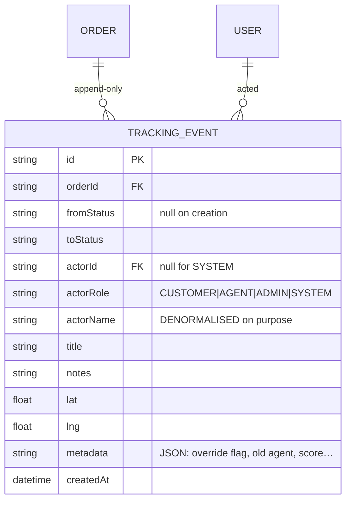

> **Why `actorName` is denormalised:** if an account is later renamed or deleted,
> the history must still read the way it read on the day. That is the entire
> point of an audit log — a join would quietly rewrite the past.

---

## 🔔 Notifications

> 📄 Full write-up: **[docs/NOTIFICATIONS.md](docs/NOTIFICATIONS.md)**

E-mail on **every** status change, SMS at the moments a customer actually needs
to act on — delivered through a **transactional outbox**.

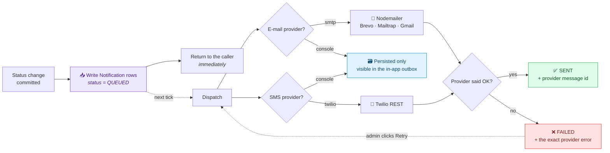

**The `console` transport is a product decision, not a stub.** A reviewer
cloning this repo has no SMTP credentials and no Twilio account, and an
assignment that only demonstrates notifications when secrets are present
demonstrates nothing. With `NOTIFY_*_PROVIDER=console` every message is still
**rendered, persisted and surfaced in the in-app outbox** — you can read the
actual branded HTML e-mail that would have gone out. Point the same code at SMTP
or Twilio and real messages send, with no other change.

| Event | 📧 E-mail | 📱 SMS |
|---|:---:|:---:|
| Order created | ✅ | ✅ |
| Agent assigned | ✅ | ✅ |
| Picked up · in transit | ✅ | — |
| Out for delivery | ✅ | ✅ |
| Delivered | ✅ | ✅ |
| **Delivery failed** | ✅ *(with a reschedule CTA)* | ✅ |
| Rescheduled | ✅ | ✅ |
| Cancelled | ✅ | ✅ |
| Welcome | ✅ | — |

---

## 🗄 Database schema

> 📄 Column-by-column reference: **[docs/DATABASE.md](docs/DATABASE.md)**
> · Source: [`server/prisma/schema.prisma`](server/prisma/schema.prisma)

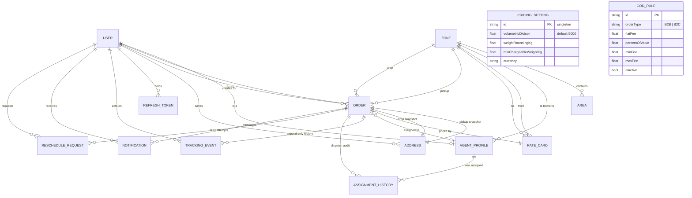

<div align="center"><i>13 tables. PRICING_SETTING and COD_RULE stand alone — they are configuration, referenced by the engine rather than by foreign keys.</i></div>

| Table | Rows it holds | Notable |
|---|---|---|
| `User` | Customers, agents and admins in one table | `role` drives every authorisation decision |
| `RefreshToken` | Rotating sessions | Stores SHA-256 digests — a DB leak cannot mint sessions |
| `AgentProfile` | Duty state, GPS, capacity, record | What the dispatcher scores against |
| `Zone` | Pricing/operations regions | Rate cards are written against these |
| `Area` | One row per serviceable pincode | `pincode` is `UNIQUE` → `O(1)` detection |
| `Address` | Immutable per-order snapshots | Editing a saved address never rewrites history |
| `PricingSetting` | Singleton | Volumetric divisor, slab size, minimum weight |
| `RateCard` | The 2×2 matrix + lane overrides | `priority` breaks ties |
| `CodRule` | Per order type | `max(flat, pct)` then clamp |
| `Order` | The shipment | Carries a **frozen** price snapshot |
| `TrackingEvent` | 📜 Append-only | No update/delete path exists |
| `AssignmentHistory` | Every dispatch decision | Stores the ranked shortlist that justified it |
| `RescheduleRequest` | Failure recovery | Who, when, why, which attempt |
| `Notification` | The outbox | Provider, message id, error, attempts |

### One schema, two databases

SQLite locally and PostgreSQL in production, from the **same** schema file.
[`scripts/set-db-provider.mjs`](server/scripts/set-db-provider.mjs) inspects
`DATABASE_URL` and rewrites the single `provider` line before `prisma generate`
runs; it is wired into every `db:*` script, so it is impossible to forget.

Because SQLite has no native `ENUM` or `JSON` type, enumerated columns are
`String` and structured payloads are JSON-encoded `String`. The canonical values
live in [`domain/constants.ts`](server/src/domain/constants.ts) — a single source
of truth shared by the validators, the engines and the React client — and are
enforced at the API boundary by Zod.

---

## 🎨 The interface

Colourful, responsive and role-aware. One shell serves all three personas
because the navigation model is the only thing that genuinely differs.

### 📦 Customer

| Screen | What it does |
|---|---|
| **Dashboard** | Spend, success rate, live pipeline, 14-day activity chart |
| **Book a pickup** | ⭐ The charge assembles itself **live as you type** — serviceability checked inline per pincode, both zones named, volumetric vs actual compared, every line explained. The confirm button stays disabled until a real quote exists. |
| **My orders** | Status tabs, search, pagination — filter state lives in the URL |
| **Order detail** | Full price breakdown, route with detected zones, tracking timeline, reschedule after a failure |
| **Notifications** | Every message we sent, with the rendered HTML |

### 🚚 Delivery agent

| Screen | What it does |
|---|---|
| **Today's run** | Duty toggle, **one-tap GPS ping**, today's numbers, and the queue with the single most likely next action on each card |
| **Order detail** | The status ladder as buttons, plus a guided failure-reporting flow with a reason picker |
| **My deliveries** | Everything ever assigned, filterable |

### 🛡️ Operations admin

| Screen | What it does |
|---|---|
| **Control room** | Pipeline by status, throughput + revenue chart, zone volumes, agent roster, live activity feed, dispatch queue |
| **All orders** | Filter by **status / zone / agent** + type, payment, search, sort — all bookmarkable |
| **Order detail** | ⭐ The **dispatch panel**: the ranked shortlist with all four signals, the rejection list with reasons, assignment history, one-click auto-assign or manual override, plus a status override |
| **Zones & areas** | Zone CRUD, and a pincode table where the zone is a dropdown — move a pincode and every future order on it re-prices |
| **Rate cards** | ⭐ The whole engine, editable: the 2×2 matrix, lane overrides, COD rules with live worked examples, weight settings, and a **"test the engine"** panel that prices a hypothetical shipment against the live configuration |
| **Agents** | Duty state, home zone, vehicle class, capacity, last position |
| **Users** | Create customers, agents (dispatch profile provisioned automatically) and admins |
| **Analytics** | Status distribution, cumulative revenue, revenue by zone, agent performance radar |

### 🌐 Public

Track any shipment by code with **no account**, exactly like every courier. The
payload is deliberately redacted server-side — cities and the timeline yes;
street addresses, phone numbers, declared value and pricing no. A tracking
number is a weak secret, so it must not unlock personal data.

---

## 📡 API reference

> 📄 Every endpoint with request and response bodies: **[docs/API.md](docs/API.md)**

All responses share one envelope:

```jsonc
// success
{ "success": true, "data": { … }, "pagination": { … } }

// failure
{ "success": false, "error": { "code": "ZONE_NOT_SERVICEABLE", "message": "…", "details": { … } } }
```

| Group | Endpoints | Auth |
|---|---|---|
| **Meta** | `GET /api/health` · `GET /api/meta` | public |
| **Auth** | `POST /register` `/login` `/refresh` `/logout` `/change-password` · `GET /me` | mixed |
| **Pricing** | `POST /pricing/quote` | 🌐 public |
| | `GET/PUT /pricing/settings` · `GET/POST/PUT/DELETE /pricing/rate-cards` · `/cod-rules` · `GET /pricing/resolve` | 🛡️ admin writes |
| **Zones** | `GET /zones/serviceability/:pincode` | 🌐 public |
| | `GET/POST/PUT/DELETE /zones` · `/zones/areas` | 🛡️ admin writes |
| **Orders** | `POST /orders` · `GET /orders` · `GET /orders/:id` | role-scoped |
| | `PATCH /orders/:id/status` | all three roles, guarded |
| | `POST /orders/:id/assign` · `/auto-assign` · `GET /assignment-preview` · `/assignments` | 🛡️ admin |
| | `POST /orders/:id/reschedule` · `/cancel` · `GET /tracking` `/reschedules` | 📦 customer + admin |
| **Agents** | `GET /agents/me` · `PATCH /agents/me/availability` · `POST /agents/me/location` | 🚚 agent |
| | `GET /agents` · `PUT /agents/:id` · `GET /agents/:id/workload` | 🛡️ admin |
| **Users** | `GET/POST/PUT /users` · `GET /users/customers/lookup` | 🛡️ admin |
| **Notifications** | `GET /notifications` `/:id` · `GET /transports` · `POST /retry` | role-scoped |
| **Analytics** | `GET /analytics/dashboard` | role-scoped |
| **Tracking** | `GET /tracking/:code` | 🌐 public, redacted |

### Try it

```bash
# Price a shipment — no account needed
curl -X POST http://localhost:4000/api/pricing/quote \
  -H "Content-Type: application/json" \
  -d '{
    "pickupPincode": "560034", "dropPincode": "560011",
    "lengthCm": 30, "breadthCm": 20, "heightCm": 15,
    "actualWeightKg": 1.2,
    "orderType": "B2C", "paymentType": "COD", "declaredValue": 4500
  }'
```

```bash
# Sign in and list orders
TOKEN=$(curl -s -X POST http://localhost:4000/api/auth/login \
  -H "Content-Type: application/json" \
  -d '{"email":"admin@swiftroute.dev","password":"Admin@123"}' \
  | node -pe "JSON.parse(require('fs').readFileSync(0)).data.accessToken")

curl -s "http://localhost:4000/api/orders?status=FAILED" \
  -H "Authorization: Bearer $TOKEN"
```

---

## ⚙️ Configuration

Every variable is documented in [`.env.example`](.env.example) and **every one
has a safe default** — the application boots, seeds and runs end to end with an
empty `.env`.

| Group | Variables | Notes |
|---|---|---|
| **Core** | `NODE_ENV` `PORT` `API_PUBLIC_URL` `WEB_PUBLIC_URL` `CORS_ORIGINS` | |
| **Database** | `DATABASE_URL` | `file:./dev.db` or `postgresql://…` — the provider switches itself |
| **Auth** | `JWT_SECRET` `JWT_REFRESH_SECRET` `JWT_EXPIRES_IN` `JWT_REFRESH_EXPIRES_IN` `BCRYPT_ROUNDS` | ⚠️ change the secrets before any public deploy |
| **Seed** | `SEED_ADMIN_EMAIL` `SEED_ADMIN_PASSWORD` `SEED_DEMO_PASSWORD` `SEED_DEMO_ORDERS` | |
| **E-mail** | `NOTIFY_EMAIL_PROVIDER` `SMTP_*` `MAIL_FROM_*` | `console` \| `smtp` |
| **SMS** | `NOTIFY_SMS_PROVIDER` `TWILIO_*` | `console` \| `twilio` |
| **Dispatch** | `ASSIGN_MAX_DISTANCE_KM` `ASSIGN_WEIGHT_DISTANCE` `ASSIGN_WEIGHT_ZONE_MATCH` `ASSIGN_WEIGHT_WORKLOAD` `ASSIGN_WEIGHT_PERFORMANCE` | Weights re-normalise, so only ratios matter |
| **Limits** | `RATE_LIMIT_WINDOW_MS` `RATE_LIMIT_MAX` `AUTH_RATE_LIMIT_MAX` | Credential routes get a tighter bucket |

Configuration is parsed **once**, validated with Zod and exported frozen from
[`config/env.ts`](server/src/config/env.ts). Nothing else in the codebase reads
`process.env` directly.

### Wiring up real e-mail (free tier)

```env
NOTIFY_EMAIL_PROVIDER=smtp
SMTP_HOST=smtp-relay.brevo.com   # 300 mails/day free
SMTP_PORT=587
SMTP_USER=your-login
SMTP_PASS=your-smtp-key
MAIL_FROM_ADDRESS=no-reply@yourdomain.dev
```

`GET /api/notifications/transports` verifies the connection without sending
anything, and the admin Notifications screen shows the result.

---

## 🧪 Testing

```bash
npm test              # 88 cases
npm run test:watch
npm run test:coverage
```

```
✓ src/domain/orderStateMachine.test.ts   (17 tests)
✓ src/services/assignmentEngine.test.ts  (25 tests)
✓ src/services/rateEngine.test.ts        (27 tests)
✓ src/app.test.ts                        (19 tests)

Test Files  4 passed (4)
     Tests  88 passed (88)
```

**Unit tests** are pure — no database — and target the edges that actually bite:

- the IEEE-754 slab trap, where `1.5 / 0.5` evaluates to `2.9999999999999996`
  and a naive `Math.ceil` silently bills a whole extra slab;
- COD taking `max(flat, percentage)` and *then* clamping, in that order;
- GST accumulating on integer paise rather than drifting floats;
- dispatch preferring an idle in-zone agent over a saturated closer one;
- the state machine refusing to move backwards or resurrect a terminal order.

**Integration tests** drive the real Express app in-process with supertest:
envelope shape, role scoping (a customer's list only ever contains their own
orders), the enumeration-safe login, the live rate engine, and the redaction on
the public tracking endpoint. They are read-only and skip cleanly on an unseeded
database.

📄 A manual end-to-end walkthrough is in **[docs/TESTING.md](docs/TESTING.md)**.

---

## 🚢 Deployment

> 📄 Step-by-step for each platform: **[docs/DEPLOYMENT.md](docs/DEPLOYMENT.md)**

The API also serves the built React bundle, so **the whole product deploys as a
single service** — no CORS, no second cold start, one URL to share.

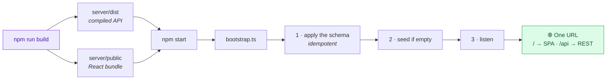

### Render (recommended — free tier)

The repo ships a [`render.yaml`](render.yaml) blueprint. **New → Blueprint →
pick this repo.** Render provisions PostgreSQL, wires `DATABASE_URL`, generates
the JWT secrets, builds both workspaces and starts the service. On first boot
the app applies the schema and seeds itself.

Afterwards set `API_PUBLIC_URL` and `WEB_PUBLIC_URL` to the live service URL so
the tracking links inside notification e-mails resolve.

### Docker

```bash
docker compose up --build     # app + PostgreSQL → http://localhost:4000
```

### Anywhere else

Any host that runs Node 20 and gives you a `PORT`:

```bash
npm ci && npm run build && npm start
```

> **Free-tier note:** free instances sleep after inactivity, so the very first
> request after a quiet period takes ~30 seconds to wake. `/api/health` is the
> cheapest way to warm it.

---

## 📁 Project structure

```
.
├── server/                          # Express + Prisma API
│   ├── prisma/
│   │   ├── schema.prisma            # 13 models, heavily commented
│   │   └── seed.ts                  # thin wrapper over src/seed
│   ├── scripts/
│   │   ├── load-env.mjs             # one canonical .env for the monorepo
│   │   ├── set-db-provider.mjs      # SQLite ⇄ PostgreSQL from DATABASE_URL
│   │   └── prisma.mjs               # the single Prisma CLI entry point
│   └── src/
│       ├── config/                  # Zod-validated env · Prisma singleton
│       ├── domain/
│       │   ├── constants.ts         # ⭐ single source of truth for every enum
│       │   └── orderStateMachine.ts # ⭐ the transition graph
│       ├── middleware/              # auth · validation · error envelope
│       ├── routes/                  # 11 routers, thin — they delegate
│       ├── services/
│       │   ├── rateEngine.ts        # ⭐ the pricing engine
│       │   ├── assignmentEngine.ts  # ⭐ the dispatcher
│       │   ├── orderService.ts      # ⭐ the transactional core
│       │   ├── trackingService.ts   # append-only history
│       │   ├── zoneService.ts       # pincode → zone
│       │   ├── authService.ts       # JWT + rotating refresh tokens
│       │   └── notifications/       # outbox · transports · templates
│       ├── seed/                    # fixtures + idempotent seeder
│       ├── utils/                   # money (integer paise) · geo · errors
│       ├── validators/              # every request shape, in Zod
│       ├── app.ts                   # middleware stack + static SPA
│       ├── server.ts                # lifecycle + graceful shutdown
│       ├── index.ts                 # dev entry point
│       └── bootstrap.ts             # prod entry: migrate → seed → listen
│
├── web/                             # React + Vite + Tailwind client
│   └── src/
│       ├── components/
│       │   ├── ui/                  # the primitive kit
│       │   ├── layout/              # role-aware shell
│       │   ├── PriceBreakdown.tsx   # ⭐ the price explainer
│       │   ├── AssignmentPanel.tsx  # ⭐ the dispatcher, made visible
│       │   ├── TrackingTimeline.tsx
│       │   ├── StatusBadge.tsx      # badge · progress rail
│       │   └── OrderTable.tsx
│       ├── context/AuthContext.tsx
│       ├── hooks/
│       ├── lib/                     # api client · types · formatting + colour
│       └── pages/
│           ├── customer/  agent/  admin/
│           ├── Landing · Login · Register · TrackPublic
│           └── OrderDetail · Notifications
│
├── docs/                            # the full documentation set
├── .github/workflows/ci.yml
├── render.yaml · Dockerfile · docker-compose.yml
└── .env.example
```

---

## 📚 Documentation index

| Document | What is in it |
|---|---|
| **[SYSTEM_DESIGN.md](docs/SYSTEM_DESIGN.md)** | 📄 The 800-word design write-up: rate engine, zone detection, auto-assignment, failed-delivery handling |
| **[RATE_ENGINE.md](docs/RATE_ENGINE.md)** | Every step of the pricing maths, resolution precedence, more worked examples, and how it evolves |
| **[AUTO_ASSIGNMENT.md](docs/AUTO_ASSIGNMENT.md)** | Signal design, weight tuning, complexity, and the road to a real VRP solver |
| **[API.md](docs/API.md)** | Every endpoint with request/response bodies and error codes |
| **[DATABASE.md](docs/DATABASE.md)** | Column-by-column schema reference, indexes, and the design rationale |
| **[ARCHITECTURE.md](docs/ARCHITECTURE.md)** | Layering, the transactional boundary, and the trade-offs taken |
| **[NOTIFICATIONS.md](docs/NOTIFICATIONS.md)** | The outbox pattern, providers, templates, delivery guarantees |
| **[DEPLOYMENT.md](docs/DEPLOYMENT.md)** | Render, Docker, Railway, Fly, and a production checklist |
| **[TESTING.md](docs/TESTING.md)** | The automated suite plus a manual end-to-end walkthrough |
| **[CONTRIBUTING.md](docs/CONTRIBUTING.md)** | Conventions, commit style, and how to add a status or a rate rule |

---

## 📋 Requirements traceability

<details>
<summary><b>Every line of the brief, and where it lives</b></summary>

| Requirement | Status | Where |
|---|:---:|---|
| Pickup & drop address, L×B×H, weight, B2B/B2C, prepaid/COD | ✅ | [`NewOrder.tsx`](web/src/pages/customer/NewOrder.tsx) · [`validators`](server/src/validators/index.ts) |
| Auto-calculated charge, agent assignment, status tracking, notifications | ✅ | [`orderService.ts`](server/src/services/orderService.ts) |
| Admin manages zones and assigns areas to zones | ✅ | [`Zones.tsx`](web/src/pages/admin/Zones.tsx) · [`zones.routes.ts`](server/src/routes/zones.routes.ts) |
| Rate cards: intra **and** inter-zone, separately for B2B **and** B2C | ✅ | [`Pricing.tsx`](web/src/pages/admin/Pricing.tsx) · `RateCard` model |
| COD surcharge configurable **per order type** | ✅ | `CodRule` model · [`codSurchargeFor`](server/src/services/rateEngine.ts) |
| Customer can register, log in, place an order | ✅ | [`authService.ts`](server/src/services/authService.ts) |
| Admin can create an order **on behalf of** a customer | ✅ | `customerId` on `POST /api/orders` + the customer picker |
| Zone detection on order creation | ✅ | [`zoneService.ts`](server/src/services/zoneService.ts) |
| Volumetric weight = L×B×H ÷ 5000 | ✅ | `volumetricWeight()` — divisor is configurable |
| Bill on the higher of actual vs volumetric | ✅ | `chargeableWeight()` |
| Zone rate from the correct card (B2B/B2C) | ✅ | `resolveRateCard()` with lane-override precedence |
| COD surcharge applied when applicable | ✅ | `codSurchargeFor()` |
| **Charge shown before the customer confirms** | ✅ | Live quote panel — re-prices as you type |
| Admin can **manually** assign an agent | ✅ | `POST /orders/:id/assign` + the dispatch panel |
| Admin can trigger **auto-assignment** to the nearest available agent | ✅ | `POST /orders/:id/auto-assign` |
| Agent updates status: Picked Up / In Transit / Out for Delivery / Delivered / Failed | ✅ | `PATCH /orders/:id/status`, role-guarded |
| On failure: customer notified **and** can reschedule | ✅ | `deliveryFailedTemplate` + `POST /orders/:id/reschedule` |
| Agent **reassigned** for the rescheduled attempt | ✅ | `autoAssign(excludeAgentId)` |
| Customer views live status and the full tracking timeline | ✅ | Order detail + public tracking |
| **E-mail on every status change** | ✅ | `notifyStatusChange` on every transition |
| Admin views all orders, filters by **status/zone/agent** | ✅ | [`admin/Orders.tsx`](web/src/pages/admin/Orders.tsx) |
| Admin can **override any order status** | ✅ | `override: true`, recorded on the event |
| Backend API, frontend, database, role-based auth | ✅ | Express · React · Prisma · JWT + 3 roles |
| Rate engine **fully admin-configurable, no hardcoding** | ✅ | Every value from `PricingSetting` / `RateCard` / `CodRule` |
| Auto-assignment by current location **or** zone | ✅ | GPS fix → area centroid → zone centroid |
| **Immutable** tracking history with timestamp and actor | ✅ | `TrackingEvent` — no update/delete path exists |
| Failed flow: flagged, notified, reschedule captured, agent reassigned | ✅ | All four, in one transaction each |
| **Email and SMS** integration (any free tier) | ✅ | Nodemailer/SMTP + Twilio, with a console fallback |
| README with setup, `.env.example`, API docs, DB schema, rate logic | ✅ | This file + [`docs/`](docs/) |
| System design write-up (≤ 800 words) | ✅ | [SYSTEM_DESIGN.md](docs/SYSTEM_DESIGN.md) |
| Hosted application URL | ✅ | [`render.yaml`](render.yaml) — see [DEPLOYMENT.md](docs/DEPLOYMENT.md) |

</details>

---

## 📝 Notable engineering decisions

| Decision | Why |
|---|---|
| **Integer paise arithmetic** | Accumulating 18% GST on a float subtotal is exactly how invoices end up off by a rupee. Every intermediate result snaps back to paise. |
| **Frozen price snapshot per order** | Editing a rate card must change tomorrow's quotes, never yesterday's invoices. |
| **Enums in code, not the database** | SQLite has no `ENUM`. One `constants.ts` feeds the validators, the engines and the client, so adding a status is a one-line change the compiler then propagates. |
| **Rotating, hashed refresh tokens** | A stolen token dies at the legitimate client's next refresh; a dump of the tokens table cannot mint a single session. |
| **Notifications outside the transaction** | A mail server must never be able to roll back a delivery. |
| **`console` notification transport** | An assignment that only demonstrates notifications when secrets are present demonstrates nothing. |
| **Single-service deployment** | One free-tier instance, no CORS, one URL — and the identical bundle you tested locally. |
| **Dispatcher explains itself** | An auto-assigner that is a black box is impossible to trust and impossible to debug. |

---

<div align="center">

**Built for the Unthinkable last-mile delivery assignment.**

Node · Express · Prisma · TypeScript · React · Vite · TailwindCSS

MIT licensed

</div>
