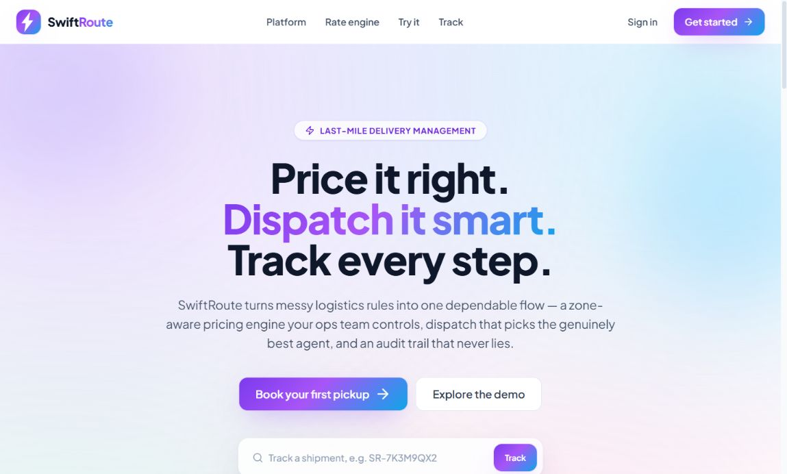
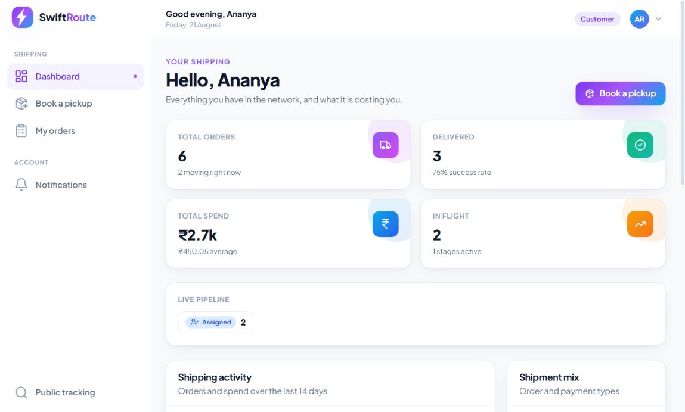
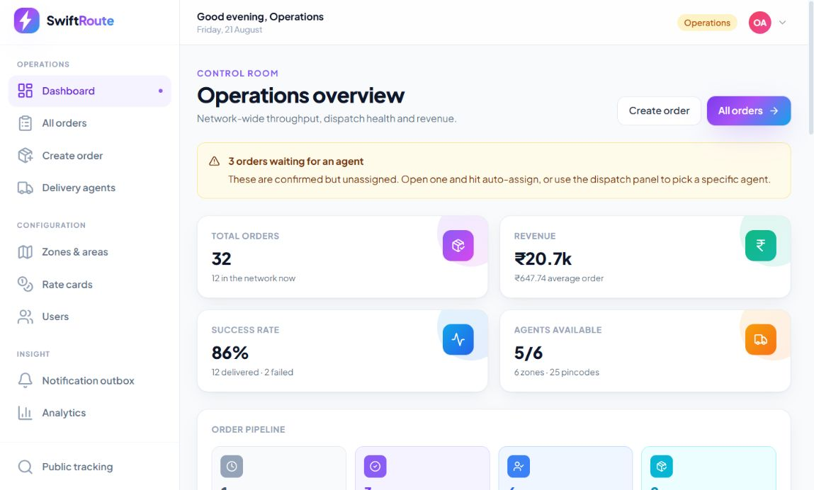
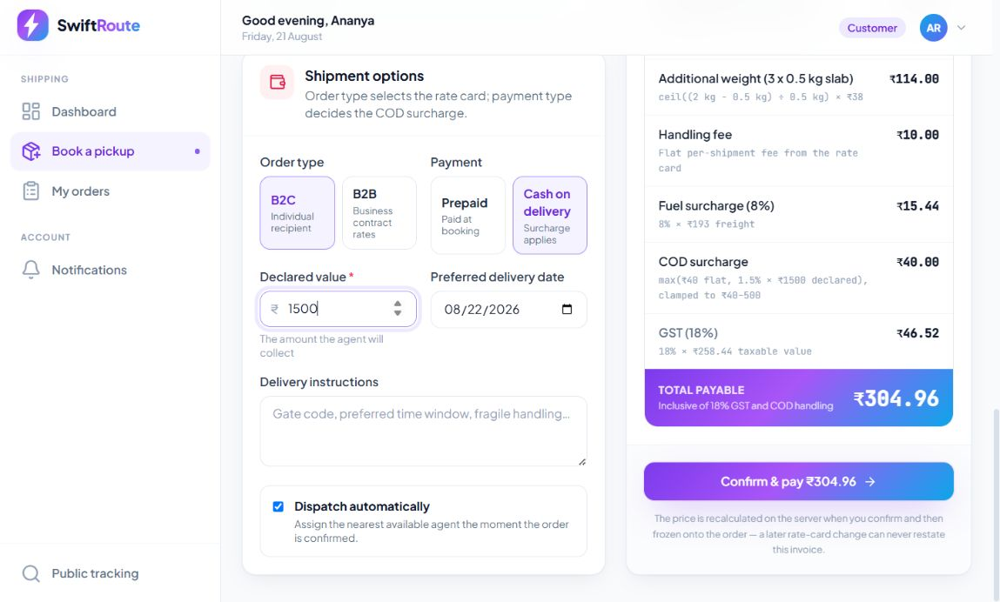
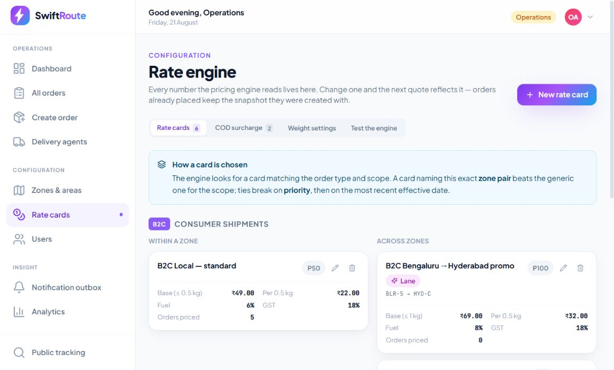
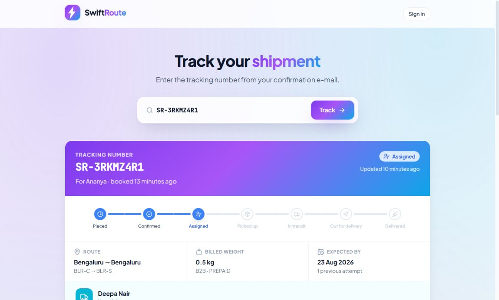
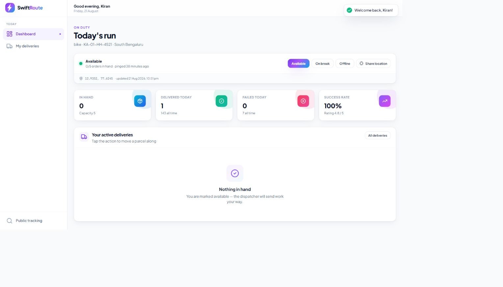
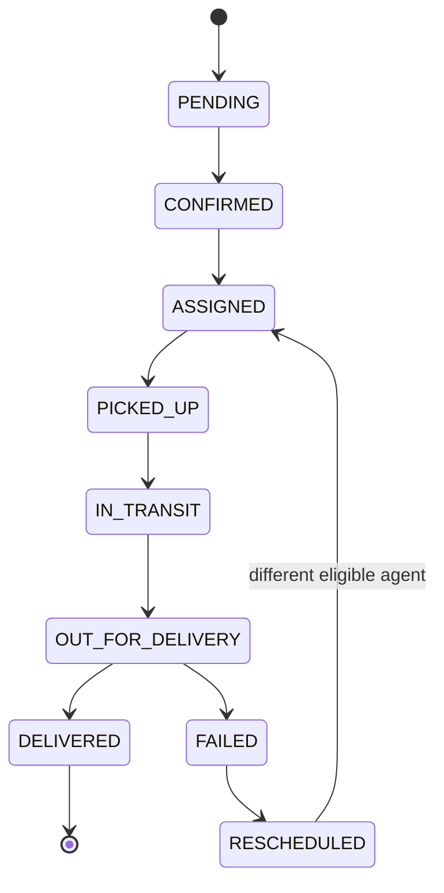
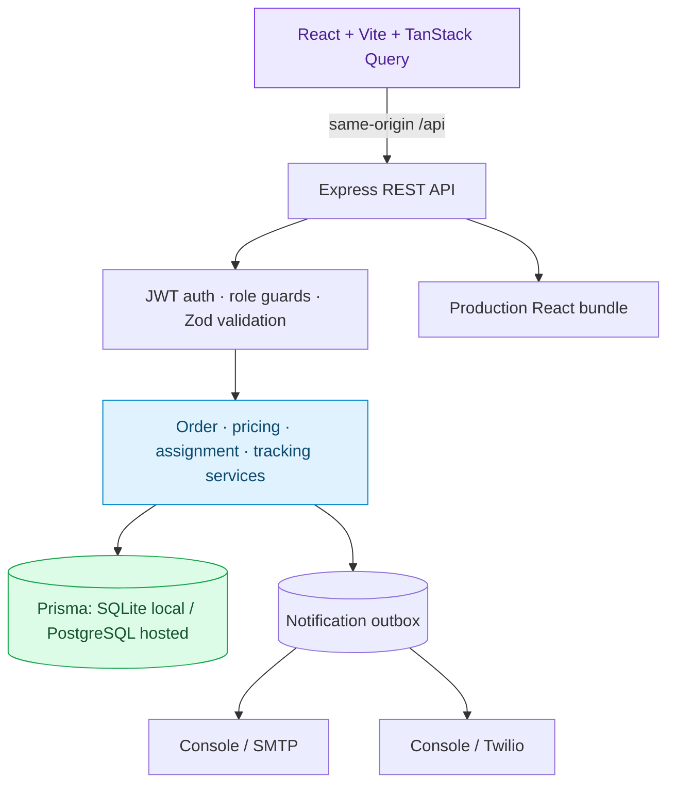

# SwiftRoute — Last-Mile Delivery Tracker

<div align="center">

**Price it right. Dispatch it smart. Track every step.**

A colourful, production-shaped delivery management platform for customers,
delivery agents, and operations teams.

[](https://swiftroute-am6m.onrender.com)
[](https://swiftroute-am6m.onrender.com/api/health)
[](docs/TESTING.md)

[Deploy your own copy](https://render.com/deploy?repo=https://github.com/Shanmuk4622/Unthinkable-LastMile-Delivery-Track-assignment)
· [API contract](docs/API.md)
· [System design](docs/SYSTEM_DESIGN.md)
· [Deployment guide](docs/DEPLOYMENT.md)

</div>



> The hosted demo runs on Render's free tier. If it has been idle, the first
> request can take about one minute while the service wakes up.

## Try the live product

The sign-in screen has one-click demo selectors, or use these credentials:

| Persona | E-mail | Password | Best place to start |
|---|---|---|---|
| Operations admin | `admin@swiftroute.dev` | `Admin@123` | `/admin` |
| Customer | `customer@swiftroute.dev` | `Demo@123` | `/app` |
| Delivery agent | `agent@swiftroute.dev` | `Demo@123` | `/agent` |

### Five-minute evaluator walkthrough

1. Sign in as **Customer** and choose **Book a pickup**.
2. Use pickup pincode `560034`, drop pincode `560001`, package
   `30 × 20 × 15 cm`, and actual weight `1.2 kg`.
3. Choose **B2C + COD** and declared value `₹1,500`. The live quote should show
   volumetric weight `1.8 kg`, chargeable weight `2 kg`, and total `₹304.96`.
4. Confirm the order. Sign in as **Admin** to inspect the ranked dispatch
   candidates or manually assign an agent.
5. Sign in as **Agent** and advance the shipment. Report a failed attempt to
   reveal the customer's reschedule action.
6. Reschedule as **Customer**. The failed agent is excluded and a different
   eligible agent is selected. Open the tracking code while signed out to see
   the public, redacted timeline.

## What is implemented

| Assignment requirement | Implementation |
|---|---|
| Customer/admin order creation | Role-aware booking flows with customer selection for admins |
| Charge shown before confirmation | Debounced server quote with complete arithmetic breakdown |
| Zone detection | Indexed `pincode → Area → Zone` serviceability lookup |
| B2B/B2C and intra/inter-zone pricing | Admin-managed 2×2 rate-card matrix plus exact-lane overrides |
| Volumetric billing | `(L × B × H) ÷ configurable divisor`; higher of actual/volumetric; upward slab rounding |
| COD surcharge | Per-order-type flat/percentage rule with configurable floor and ceiling |
| Manual and automatic assignment | Explainable four-signal ranking, hard eligibility filters, manual override |
| Agent lifecycle updates | Picked up → in transit → out for delivery → delivered/failed |
| Immutable tracking history | Append-only event for every transition with timestamp, actor, role, and notes |
| Failed-delivery recovery | Required reason, customer notification, reschedule record, fresh dispatch |
| Customer tracking | Authenticated detail plus safe public tracking by code |
| E-mail and SMS | Transactional outbox, SMTP and Twilio adapters, retryable admin view |
| Admin controls | Zones, areas, rate cards, COD rules, users, agents, filters, analytics, status override |
| Role-based auth | Customer, agent, and admin scopes; rotating refresh tokens; route and data guards |

## Product tour

<table>
  <tr>
    <td width="50%"></td>
    <td width="50%"></td>
  </tr>
  <tr>
    <td align="center"><b>Customer workspace</b><br>Orders, spend, pipeline, booking, and notifications</td>
    <td align="center"><b>Operations control room</b><br>Network metrics, dispatch health, agents, and revenue</td>
  </tr>
</table>

<table>
  <tr>
    <td width="50%"></td>
    <td width="50%"></td>
  </tr>
  <tr>
    <td align="center"><b>Explainable live quote</b><br>Every weight, slab, fee, surcharge, and tax is visible</td>
    <td align="center"><b>No hardcoded pricing</b><br>Operators control every rate and global weight setting</td>
  </tr>
</table>

<table>
  <tr>
    <td width="50%"></td>
    <td width="50%"></td>
  </tr>
  <tr>
    <td align="center"><b>Safe public tracking</b><br>Route, milestones, ETA, agent, and complete timeline</td>
    <td align="center"><b>Agent run sheet</b><br>Availability, capacity, performance, and next action</td>
  </tr>
</table>

Public tracking intentionally excludes street addresses, phone numbers,
declared value, and charges.

## Core delivery flow

```mermaid
flowchart LR
    A[Addresses + parcel + order/payment type] --> B[Pincode zone detection]
    B --> C[Rate-card resolution]
    C --> D[Explainable quote]
    D -->|customer confirms| E[Server recomputes and freezes price]
    E --> F[Manual or intelligent assignment]
    F --> G[Agent status lifecycle]
    G --> H[Immutable tracking event]
    H --> I[Email/SMS outbox]
    G -->|failed| J[Customer reschedules]
    J -->|exclude failed agent| F

    style D fill:#ede9fe,stroke:#7c3aed,color:#4c1d95
    style F fill:#e0f2fe,stroke:#0284c7,color:#0c4a6e
    style H fill:#fef3c7,stroke:#d97706,color:#78350f
    style J fill:#fee2e2,stroke:#dc2626,color:#7f1d1d
```



## The engineering that matters

### 1. Rate engine: transparent and configuration-driven

All business values come from `PricingSetting`, `RateCard`, and `CodRule`.
Prices are computed in integer paise and weights are slabbed in integer grams,
avoiding floating-point overbilling at exact boundaries.

```text
volumetric = (length × breadth × height) ÷ divisor
chargeable = ceil(max(actual, volumetric, minimum) ÷ slab) × slab
freight    = basePrice + extraSlabs × incrementalPrice
COD        = clamp(max(flatFee, percent × declaredValue), minFee, maxFee)
total      = freight + handling + fuel + COD + GST
```

Exact-lane cards beat generic intra/inter-zone cards. The server recalculates
the quote on confirmation and stores the full pricing snapshot, so changing a
rate card cannot rewrite an old invoice.

See [RATE_ENGINE.md](docs/RATE_ENGINE.md) for formulas, precedence, failure
modes, and worked B2B/B2C examples.

### 2. Assignment engine: nearest eligible, not merely nearest

Hard filters first remove inactive, unavailable, saturated, overweight, and
excluded agents. The remaining candidates receive a normalized score:

```text
score = 0.50 × proximity
      + 0.25 × zone familiarity
      + 0.15 × spare workload
      + 0.10 × delivery performance
```

Weights and search radius are environment-configurable. The complete ranked
shortlist—including rejected agents and reasons—is stored in
`AssignmentHistory` and shown to admins.

See [AUTO_ASSIGNMENT.md](docs/AUTO_ASSIGNMENT.md).

### 3. Lifecycle and failed-delivery recovery



Every transition updates the order, appends its tracking event, adjusts agent
capacity, and closes assignment custody in one database transaction. A failure
requires a reason, releases the agent, notifies the customer, and records a
reschedule request before dispatch runs again.

### 4. Notifications that remain demonstrable without secrets

Every status change generates an e-mail; action-worthy events also generate an
SMS. Messages are persisted before provider dispatch, so an SMTP outage cannot
roll back a shipment or erase the message. The hosted demo uses the `console`
transport: rendered messages are marked sent and remain visible in the admin
outbox. Set SMTP/Twilio credentials to deliver them externally.

See [NOTIFICATIONS.md](docs/NOTIFICATIONS.md) and the
[provider setup](docs/DEPLOYMENT.md#wiring-real-notifications).

## Architecture



The production build is one service: Vite writes the client into
`server/public`, and Express serves both the API and SPA. This removes CORS and
second-service cold-start problems on a free host.

| Layer | Technology |
|---|---|
| Frontend | React 18, TypeScript, Vite, Tailwind CSS, TanStack Query, Recharts, Framer Motion |
| Backend | Node 20+, Express, TypeScript, Zod, JWT, bcrypt |
| Data | Prisma 5; SQLite locally and PostgreSQL in production; 14 models |
| Notifications | Nodemailer SMTP, Twilio REST, transactional outbox |
| Verification | Vitest, Supertest, strict TypeScript, production build smoke check |
| Hosting | Render Blueprint: one web service + managed PostgreSQL |

More detail: [ARCHITECTURE.md](docs/ARCHITECTURE.md),
[DATABASE.md](docs/DATABASE.md), and the assignment-sized
[SYSTEM_DESIGN.md](docs/SYSTEM_DESIGN.md) (under 800 words).

## Run locally

### Prerequisites

- Node.js `20+`
- npm `10+`
- No database installation is required; local development uses SQLite.

### Setup

```bash
git clone https://github.com/Shanmuk4622/Unthinkable-LastMile-Delivery-Track-assignment.git
cd Unthinkable-LastMile-Delivery-Track-assignment
cp .env.example .env
npm run setup
npm run dev
```

Open:

- Frontend: `http://localhost:5173`
- API: `http://localhost:4000/api`
- Health: `http://localhost:4000/api/health`

`npm run setup` installs dependencies, generates Prisma Client, creates the
SQLite schema, and seeds zones, areas, pricing, users, agents, orders, tracking
events, and notifications. The defaults in `.env.example` work immediately.

### Useful commands

```bash
npm run dev            # API + web in watch mode
npm test               # 88 automated tests
npm run typecheck      # strict TypeScript in both workspaces
npm run build          # production API and frontend bundles
npm run db:studio      # inspect the database
npm run db:reset       # reset and reseed local data
```

## Verification

The live deployment was exercised through the real browser UI—not only by API
calls.

| Area | Verified behaviour |
|---|---|
| Public | Landing, registration validation, invalid/valid tracking, redaction, SPA deep links |
| Customer | Login, dashboard, order list/detail, notifications, live quote, booking, reschedule |
| Agent | Assigned queue, every permitted transition, required failure reason, capacity release |
| Admin | All nine admin routes, order search/filter, dispatch ranking, manual assignment, override dialog |
| Recovery | Failure → notification → customer reschedule → previous-agent exclusion → reassignment |
| API | Health/database status, unauthenticated 401, protected role scopes |

Automated suite:

```text
Test Files  4 passed (4)
Tests       88 passed (88)
```

The pricing suite covers paise precision, slab boundary traps, lane precedence,
COD floor/ceiling rules, and the complete worked invoice. Dispatch tests cover
all four signals and hard filters. API tests cover auth, scoping, redaction,
errors, and serviceability. Details and reproducible manual checks are in
[TESTING.md](docs/TESTING.md).

## API at a glance

All responses use a consistent envelope and all protected list/detail queries
are scoped to the authenticated actor.

```text
POST   /api/auth/register                  public customer registration
POST   /api/auth/login                     role-aware login
POST   /api/pricing/quote                  preview a configured price
POST   /api/orders                         create and confirm an order
PATCH  /api/orders/:id/status              lifecycle transition / admin override
POST   /api/orders/:id/auto-assign         run intelligent dispatch
POST   /api/orders/:id/assign              manual admin assignment
POST   /api/orders/:id/reschedule          failed-delivery reschedule
GET    /api/tracking/:code                 public redacted timeline
GET    /api/notifications                  scoped outbox
GET    /api/analytics/dashboard            operations metrics
```

See [API.md](docs/API.md) for every route, payload, response, validation rule,
role, and error code.

## Deploy free on Render

[](https://render.com/deploy?repo=https://github.com/Shanmuk4622/Unthinkable-LastMile-Delivery-Track-assignment)

The included [`render.yaml`](render.yaml) provisions PostgreSQL, generates JWT
secrets, builds both workspaces, applies the schema, and seeds the database.

1. Click **Deploy to Render** and connect the GitHub repository.
2. Enter non-public values for `SEED_ADMIN_PASSWORD` and
   `SEED_DEMO_PASSWORD` when prompted.
3. Wait for the database and web service to become **Available/Live**.
4. Set `API_PUBLIC_URL` and `WEB_PUBLIC_URL` to the generated web-service URL.
5. Open `/api/health`, then sign in and place one test order.

For screenshots of every Render screen, exact field values, cold-start/database
limits, real e-mail setup, Docker, and troubleshooting, follow
[DEPLOYMENT.md](docs/DEPLOYMENT.md).

## Repository map

```text
.
├── server/
│   ├── prisma/schema.prisma       14-model data schema
│   └── src/
│       ├── domain/                statuses and transition graph
│       ├── routes/                REST interface
│       ├── services/              pricing, assignment, orders, tracking
│       └── services/notifications outbox, transports, templates
├── web/src/
│   ├── components/                shared UI and dispatch explanation
│   ├── contexts/                  authentication/session lifecycle
│   └── pages/                     public, customer, agent, admin screens
├── docs/                          focused engineering documentation
├── render.yaml                    one-click free deployment blueprint
├── Dockerfile                     multi-stage non-root image
└── .env.example                   every configurable setting
```

## Documentation index

| Document | Purpose |
|---|---|
| [SYSTEM_DESIGN.md](docs/SYSTEM_DESIGN.md) | Required sub-800-word design submission |
| [ARCHITECTURE.md](docs/ARCHITECTURE.md) | Boundaries, transactions, auth, frontend, scale trade-offs |
| [RATE_ENGINE.md](docs/RATE_ENGINE.md) | Formula, rate resolution, examples, money precision |
| [AUTO_ASSIGNMENT.md](docs/AUTO_ASSIGNMENT.md) | Eligibility, distance, scoring, retries, explainability |
| [DATABASE.md](docs/DATABASE.md) | 14-model ER design, indexes, constraints, portability |
| [API.md](docs/API.md) | Complete REST contract and authorization matrix |
| [NOTIFICATIONS.md](docs/NOTIFICATIONS.md) | Outbox, templates, provider adapters, guarantees |
| [TESTING.md](docs/TESTING.md) | 88-test coverage and manual end-to-end walkthrough |
| [DEPLOYMENT.md](docs/DEPLOYMENT.md) | Render-first deployment and troubleshooting |
| [CONTRIBUTING.md](docs/CONTRIBUTING.md) | Conventions and extension recipes |

## Security and integrity notes

- Access tokens are short-lived; refresh tokens rotate and are stored as
  SHA-256 hashes in HTTP-only cookies.
- Every input path is validated with Zod and every role is authorized at route,
  query-scope, ownership, and lifecycle levels.
- Helmet, CORS, compression, request limits, rate limits, and production-safe
  error envelopes are enabled.
- Tracking history has no public update/delete route and is written in the same
  transaction as each order mutation.
- Public tracking is deliberately redacted.
- Demo credentials are public by design; change seed passwords for a private or
  production deployment.

---

Built for the **Unthinkable Last-Mile Delivery Tracker assignment** by
[Shanmukesh Bonala](https://github.com/Shanmuk4622).
