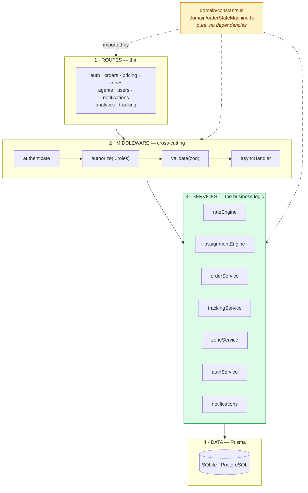
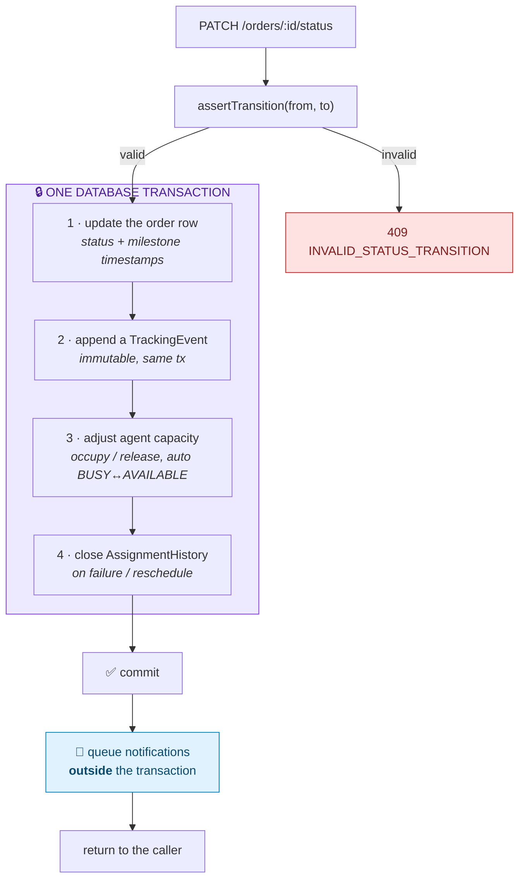
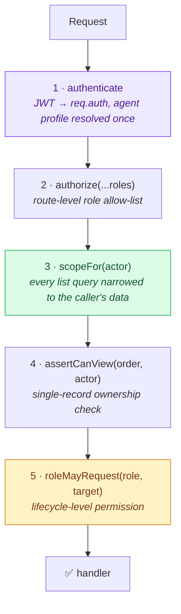
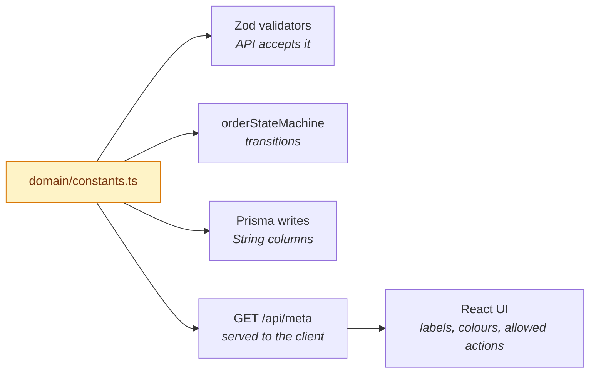
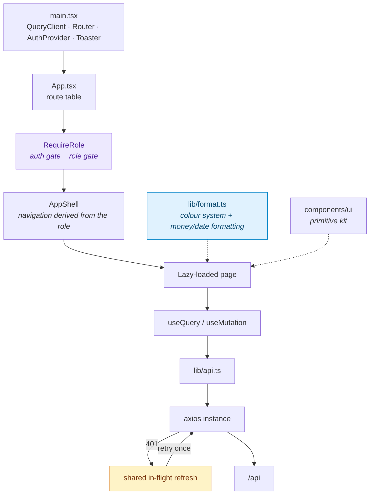
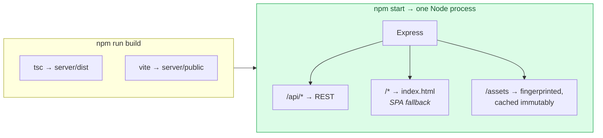

# 🏗 Architecture

> How the pieces fit together, where the boundaries are, and which trade-offs
> were taken deliberately.

---

## Contents

1. [Layering](#layering)
2. [The transactional core](#the-transactional-core)
3. [Where authorisation happens](#where-authorisation-happens)
4. [The single source of truth](#the-single-source-of-truth)
5. [Frontend architecture](#frontend-architecture)
6. [Single-service deployment](#single-service-deployment)
7. [Trade-offs taken](#trade-offs-taken)
8. [What would change at scale](#what-would-change-at-scale)

---

## Layering

Four layers, each with one job. Dependencies point strictly downward.



| Layer | Responsibility | Explicitly **not** its job |
|---|---|---|
| **Routes** | HTTP shape: parse, delegate, serialise | Business rules, database access |
| **Middleware** | Identity, authorisation, validation, error envelope | Domain decisions |
| **Services** | All business logic and transactions | Knowing about `req`/`res` |
| **Domain** | Constants and the state machine — pure functions | Anything I/O |
| **Data** | Persistence | Validation |

A route handler is typically five lines: pull the validated body, call a
service, wrap the result. That is what keeps the business logic testable without
spinning up HTTP.

### Why the engines are separate from the services that use them

`rateEngine` and `assignmentEngine` export **pure functions**
(`volumetricWeight`, `chargeableWeight`, `freightFor`, `codSurchargeFor`,
`proximitySignal`, `zoneSignal`, …) alongside their database-touching
orchestrators. That split is what makes 52 of the 88 tests possible without a
database, and it means the maths can be reasoned about in isolation from the
persistence.

---

## The transactional core

Every write path in the application goes through
[`orderService.ts`](../server/src/services/orderService.ts), because four things
must happen together or not at all.



### Inside the boundary

The order row, its history, the agent's capacity counter and the assignment
record. If any of these fail, none of them happen — which is what makes
"`activeOrderCount` is always accurate" a guarantee rather than a hope.

### Outside the boundary — deliberately

Notification dispatch. **A slow or broken mail server must never be able to roll
back a delivery.** The notification rows are themselves written first (an
outbox), so nothing is lost; only the *sending* is out of band.

```
✅ status change committed  →  rows written  →  provider called
❌ status change committed  →  provider called  →  timeout  →  rollback ← never
```

---

## Where authorisation happens

Four layers, each narrower than the last. A customer cannot see, let alone
touch, another customer's shipment even by guessing an id.



`scopeFor` is the important one — it is applied to the `where` clause itself, so
scoping is not something a handler can forget:

```ts
switch (actor.role) {
  case 'ADMIN': return {};                                     // everything
  case 'AGENT': return { agentId: agentProfileId ?? '__none__' };
  default:      return { customerId: actor.id };               // own orders only
}
```

The `'__none__'` sentinel matters: an `AGENT` account somehow lacking a profile
matches nothing, rather than falling through to an unfiltered query.

---

## The single source of truth



Adding an order status is a **one-line change** to `ORDER_STATUSES` plus its
metadata and transition edges. The compiler then propagates it: every
`Record<OrderStatus, …>` in the codebase fails to typecheck until it is handled,
the validators accept it automatically, and the client receives it through
`/api/meta` without a redeploy of hardcoded strings.

---

## Frontend architecture



### Decisions worth naming

**One shell, three personas.** `AppShell` derives its navigation from
`user.role`. Three near-identical layouts would have drifted apart within a week;
the navigation model is the only thing that genuinely differs.

**Lazy loading per persona.** Every authenticated page is a `lazy()` import, so
a customer never downloads the admin console. The largest admin page (`Pricing`,
48 kB) is not in a customer's bundle at all.

**Server state is not app state.** TanStack Query owns everything fetched;
`useState` owns only form drafts and open/closed flags. There is no Redux-shaped
mirror of the database to keep in sync.

**One shared refresh.** Six queries expiring simultaneously await the *same*
in-flight refresh. Without that, token rotation would invalidate five of its own
siblings.

**Filter state in the URL.** The admin order list and the customer order list
keep filters in `searchParams`, so "failed orders in BLR-S" is a shareable link
and the back button behaves.

**Colour as a system.** [`lib/format.ts`](../web/src/lib/format.ts) maps each
status to a badge class, a solid fill, a tint, a text colour and a hex. A
shipment is therefore the same colour in its badge, its timeline node, its
progress rail and its chart series — which is why the UI reads as one product
rather than twenty screens.

---

## Single-service deployment



Vite emits **directly into `server/public`**, and Express serves it with a
regex-guarded SPA fallback (`/^\/(?!api).*/`) so deep links work while unknown
API routes still return JSON 404s.

Why this matters on a free tier:

| | Split deployment | Single service ✅ |
|---|---|---|
| Cold starts | two | one |
| CORS | must be configured and can break | not in the picture |
| URLs to share | two | one |
| Env drift between client and API | possible | impossible |

Static asset caching is split correctly: Vite fingerprints its assets so they
are `immutable, max-age=31536000`, while `index.html` is `no-cache` — otherwise
a deploy would never reach a returning visitor.

---

## Trade-offs taken

| Decision | Gained | Given up | Why it was right here |
|---|---|---|---|
| **SQLite by default** | Clone → running in 60 s, no Docker | Native enums, `Json`, `Decimal` | A reviewer's first two minutes decide everything. PostgreSQL is one env var away. |
| **Enums in code** | One source of truth, compiler-enforced exhaustiveness | DB-level constraint | Zod at the boundary is genuinely strict, and the client gets the list for free via `/api/meta` |
| **Money as `Float` + integer-paise arithmetic** | Portability, ergonomic aggregation | `Decimal`'s guarantees | Every operation goes through `utils/money.ts`, with named tests for the drift cases |
| **`O(n)` dispatch scan** | No spatial dependency, exact, portable | Sub-linear candidate lookup | The real search space is "agents on duty" — tens of rows. Optimising it would be a dependency bought for nothing. |
| **Notifications outside the transaction** | A mail outage cannot roll back a delivery | Exactly-once delivery | At-least-once is the right trade for customer notifications: a duplicate SMS is a nuisance, a missing one is a support ticket |
| **`console` transport by default** | The whole flow is demonstrable with zero secrets | Nothing actually sends | It is one env var to make it real, and the messages are still fully rendered and stored |
| **Read-only integration tests** | Safe to run against a live dev database | Coverage of write paths in HTTP | Write paths are covered by unit tests + a documented manual walkthrough; a suite that mutates a shared database is a suite nobody trusts |
| **`db push` on boot** | Free-tier hosts with no release phase just work | A migration history | `BOOTSTRAP_DB=false` switches to `migrate deploy` for a real production |

---

## What would change at scale

Roughly in the order each becomes the actual bottleneck.

**1 · Notification dispatch → a real queue.** Today `flush()` runs on the next
tick in-process. At volume this belongs in BullMQ/Redis with retry backoff and a
dead-letter queue. The outbox table already *is* the queue — only the consumer
moves.

**2 · Dispatch → pre-filtered candidates.** Push availability, zone and capacity
into the `WHERE` clause, then a bounding box on coordinates, then PostGIS
`ST_DWithin`. The scoring functions are pure and survive every step unchanged.

**3 · Analytics → materialised.** `GET /analytics/dashboard` currently loads
orders and aggregates in memory, which is fine for thousands and wrong for
millions. It becomes a nightly rollup table or a read replica.

**4 · Live tracking → push.** The client polls every 30–45 s. Server-Sent Events
or WebSockets would replace polling and make the agent's map genuinely live.

**5 · One order at a time → batched routing.** The single largest *product*
limitation: real dispatch batches parcels going to the same building. That is a
VRP solver, and it would consume the same eligibility and scoring primitives to
build its cost matrix.

---

## Related

- 📄 [SYSTEM_DESIGN.md](SYSTEM_DESIGN.md) — the condensed write-up
- 📄 [DATABASE.md](DATABASE.md) — the data model
- 📄 [RATE_ENGINE.md](RATE_ENGINE.md) · [AUTO_ASSIGNMENT.md](AUTO_ASSIGNMENT.md) — the two engines
- 📄 [DEPLOYMENT.md](DEPLOYMENT.md) — getting it hosted
