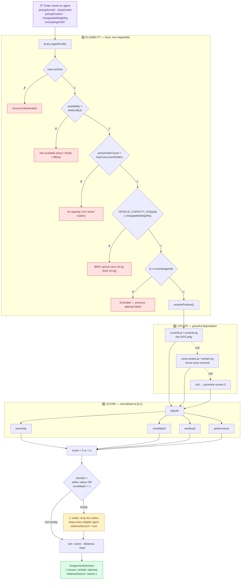
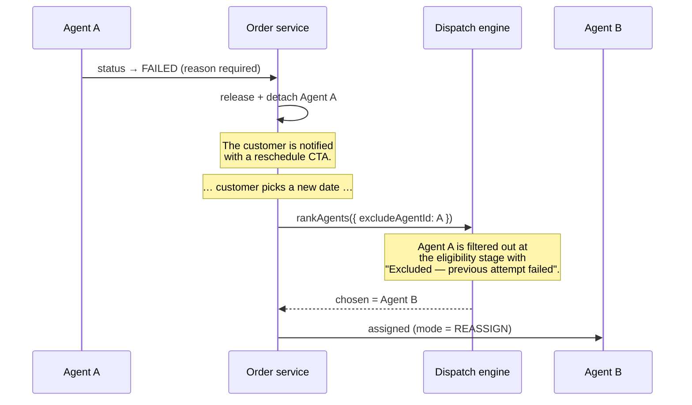

# 🎯 The Auto-Assignment Engine

> Source: [`server/src/services/assignmentEngine.ts`](../server/src/services/assignmentEngine.ts)
> · Tests: [`assignmentEngine.test.ts`](../server/src/services/assignmentEngine.test.ts)
> · Geo helpers: [`utils/geo.ts`](../server/src/utils/geo.ts)

Dispatch is a **ranking** problem, not a lookup. This document explains why, how
the score is built, how to tune it, and where it would need to change at scale.

---

## Contents

1. [Why not just "nearest"?](#why-not-just-nearest)
2. [The pipeline](#the-pipeline)
3. [Eligibility filters](#1--eligibility)
4. [Locating an agent](#2--locate)
5. [The four signals](#3--score)
6. [Picking a winner](#4--pick)
7. [Tuning the weights](#tuning-the-weights)
8. [Explainability](#explainability)
9. [Re-assignment after a failure](#re-assignment-after-a-failure)
10. [Complexity and scaling](#complexity-and-scaling)
11. [Where this goes next](#where-this-goes-next)

---

## Why not just "nearest"?

Consider a warehouse in Koramangala with four agents on duty:

| Agent | Distance | Active orders | Zone | Record |
|---|---:|---:|---|---:|
| Kiran | 0.4 km | 5 / 5 🔴 | BLR-S | 96% |
| Deepa | 1.8 km | 0 / 6 🟢 | BLR-S | 98% |
| Sameer | 2.1 km | 1 / 8 | BLR-E | 91% |
| Lakshmi | 14.0 km | 0 / 5 | BLR-N | 96% |

A pure nearest-agent dispatcher picks **Kiran** — who is already at capacity and
whose parcel will sit untouched for two hours — while Deepa, 1.4 km further and
completely idle, does nothing. Repeat that across a shift and one rider is
buried while three coast.

A pure round-robin dispatcher picks **Lakshmi**, sending a rider 14 km across
the city for a pickup two others could reach in five minutes.

SwiftRoute scores all four on signals that matter and picks **Deepa** — near
enough, free, and on home turf.

---

## The pipeline



`rankAgents()` **mutates nothing**. The caller decides whether to act on the
result, which keeps the function trivially testable and lets the admin UI render
a "who would get this?" preview with no side effects.

---

## 1 · Eligibility

Five hard filters, each producing a human-readable rejection reason that the
admin UI displays verbatim.

| Filter | Rejection reason shown |
|---|---|
| `user.isActive` | *Account deactivated* |
| `availability === 'AVAILABLE'` | *Not available (on break)* |
| `activeOrderCount < maxConcurrentOrders` | *At capacity (8/8 active orders)* |
| Vehicle can carry the weight | *BIKE cannot carry 40 kg (limit 15 kg)* |
| `id !== excludeAgentId` | *Excluded — previous attempt by this agent failed* |

### Vehicle capacity

```ts
VEHICLE_CAPACITY_KG = { BIKE: 15, SCOOTER: 25, VAN: 500, TRUCK: 5000 }
```

Checked against the **chargeable** weight, since that is what the network
actually accounted for. An unknown vehicle class does **not** block dispatch —
a typo in a config table should degrade to "assign anyway", not to "nothing can
be delivered".

### Availability is partly automatic

Agents flip to `BUSY` the moment they hit capacity and back to `AVAILABLE` when
a slot frees, inside the same transaction as the status change
([`orderService.ts`](../server/src/services/orderService.ts)). Nobody has to
remember to toggle a switch, so the dispatcher's view of the fleet is always
current.

---

## 2 · Locate

Positions degrade gracefully rather than failing:

```
agent:  live GPS fix  →  home-zone centroid  →  unlocatable (proximity = 0)
pickup: address fix   →  area centroid       →  zone centroid
```

An agent whose device is offline still gets dispatched — from their zone's
centre — instead of dropping out of consideration entirely. That matters: the
alternative is a fleet that shrinks every time a phone loses signal.

Distance is the **haversine** great-circle distance multiplied by a `1.3` road
detour factor, which is the usual planning heuristic for dense Indian metros and
keeps ETAs honest without a routing API:

```ts
estimatedRoadKm(a, b) = haversineKm(a, b) × 1.3
estimatedMinutes(km)  = (km / 22 km/h) × 60 + 8 min handling
```

The handling allowance covers parking, lifts and paperwork — the part of a
last-mile stop that has nothing to do with distance.

---

## 3 · Score

Four signals, each normalised to `[0, 1]`, combined with operator-tunable
weights.

$$\text{score} = w_{prox}\,s_{prox} + w_{zone}\,s_{zone} + w_{load}\,s_{load} + w_{perf}\,s_{perf}$$

### 📏 Proximity — default weight `0.50`

$$s_{prox} = \max\left(0,\; 1 - \frac{d_{km}}{D_{max}}\right)$$

| Distance | Signal (at `D_max = 25 km`) |
|---:|---:|
| 0 km | `1.00` |
| 5 km | `0.80` |
| 12.5 km | `0.50` |
| 25 km | `0.00` |
| 40 km | `0.00` |

Linear rather than inverse-square: dispatch cost really is roughly linear in
distance, and an inverse curve would make everything beyond 3 km
indistinguishable.

### 🗺️ Zone match — default weight `0.25`

| Agent's home zone | Signal |
|---|---:|
| = pickup zone | `1.00` |
| = drop zone | `0.40` |
| neither | `0.00` |
| no home zone | `0.00` |

Agents know their own zone: its lifts, its one-ways, its security desks, which
gate the guard actually opens. That is worth a meaningful head start over a
marginally closer outsider. Owning the *drop* zone is worth something too — the
agent finishes the trip on home turf, ready for the next job there.

### 📊 Workload — default weight `0.15`

$$s_{load} = \max\left(0,\; 1 - \frac{\text{activeOrders}}{\text{maxConcurrentOrders}}\right)$$

Capacity is already a hard filter, so this signal shapes behaviour *within* the
allowed range — it spreads work across a shift instead of clustering it on
whoever happens to be closest to the depot.

### ⭐ Performance — default weight `0.10`

$$s_{perf} = 0.7 \times \text{successRate} + 0.3 \times \frac{\text{rating}}{5}$$

with `successRate = delivered / (delivered + failed)`.

> **Cold start:** an agent with no history scores a neutral `0.8` rather than
> `0`. A zero would starve new agents of the very orders they need to build a
> record — a feedback loop that guarantees they never improve.

The weight is deliberately the smallest of the four. Performance should nudge
ties, not override geography; letting it dominate would concentrate work on a
handful of veterans and make the network fragile.

---

## 4 · Pick

```ts
ranked.sort((a, b) =>
  b.score - a.score ||            // 1. highest score
  a.distanceKm - b.distanceKm ||  // 2. then shorter trip
  a.activeOrders - b.activeOrders // 3. then lighter load
);
```

The **shortlist** is agents within `ASSIGN_MAX_DISTANCE_KM` *or* whose home zone
is the pickup zone — a same-zone agent is always considered, even if their last
GPS ping was at the far edge of the zone.

If that shortlist is empty but eligible agents exist, the search **widens once**:
the radius constraint is dropped and the decision is flagged `widenedSearch`.
The admin UI surfaces this as *"search widened beyond the 25 km radius — no
local agent was free"*, which is a coverage signal worth acting on. An order is
never silently left unassigned because of a radius setting.

If nobody is eligible at all, `autoAssign` throws a `409` carrying the rejection
list, and the order rests in `CONFIRMED` for a human.

---

## Tuning the weights

Four `.env` variables. They are **re-normalised to sum to 1**, so only the
*ratios* matter — an operator can type `5 / 2 / 2 / 1` and the score still lands
in `[0, 1]`.

```env
ASSIGN_MAX_DISTANCE_KM=25
ASSIGN_WEIGHT_DISTANCE=0.50
ASSIGN_WEIGHT_ZONE_MATCH=0.25
ASSIGN_WEIGHT_WORKLOAD=0.15
ASSIGN_WEIGHT_PERFORMANCE=0.10
```

| If you want… | Try |
|---|---|
| Tighter, faster pickups in a dense metro | `DISTANCE 0.65` · `ZONE 0.20` · `WORKLOAD 0.10` · `PERF 0.05`, `MAX_DISTANCE_KM 12` |
| Fairer distribution across a small fleet | `DISTANCE 0.35` · `ZONE 0.20` · `WORKLOAD 0.35` · `PERF 0.10` |
| High-value freight, reliability first | `DISTANCE 0.35` · `ZONE 0.25` · `WORKLOAD 0.15` · `PERF 0.25` |
| Sparse rural coverage | `MAX_DISTANCE_KM 60`, `ZONE 0.35` |

---

## Explainability

An auto-assigner that is a black box is impossible to trust and impossible to
debug, so **every automatic decision records the evidence that produced it**.

`AssignmentHistory` stores the mode (`AUTO` / `MANUAL` / `REASSIGN`), the
distance, the score, a human-readable reason, and a `candidateSnapshot` holding
the top of the ranked shortlist as it stood at decision time.

The admin UI renders exactly that:

```
Engine verdict
  Deepa Nair scored 0.913 out of 4 eligible agents · 1.8 km from pickup ·
  operates in the pickup zone · 0/6 active orders.

Ranked shortlist
┌──────────────────────────────────────────────────────────────────────┐
│ 👑 Deepa Nair       BLR-S · scooter · 1.8 km · ~13 min · 0/6   0.913  │
│    proximity 0.93 ▓▓▓▓▓▓▓░   zone 1.00 ▓▓▓▓▓▓▓▓                       │
│    capacity  1.00 ▓▓▓▓▓▓▓▓   record 0.99 ▓▓▓▓▓▓▓▓          [Assign]   │
├──────────────────────────────────────────────────────────────────────┤
│ 2  Sameer Khan      BLR-E · van · 2.1 km · ~14 min · 1/8       0.678  │
├──────────────────────────────────────────────────────────────────────┤
│ 3  Lakshmi Prasad   BLR-N · bike · 14.0 km · ~46 min · 0/5     0.464  │
└──────────────────────────────────────────────────────────────────────┘
  ▸ 1 agent filtered out
      Kiran Kumar  —  At capacity (5/5 active orders)
```

Two endpoints expose this:

| Endpoint | Purpose |
|---|---|
| `GET /api/orders/:id/assignment-preview` | Dry run — score everyone, change nothing |
| `GET /api/orders/:id/assignments` | The audit trail, with each decision's snapshot |

---

## Re-assignment after a failure

The one place the engine is called with `excludeAgentId` set.



Excluding the failed agent is a fairness and outcome decision, not a punishment.
If an agent could not find the address or the customer would not answer their
call, sending the same person again is the least likely thing to work. The
exclusion is scoped to that one retry — the agent remains fully eligible for
every other order.

---

## Complexity and scaling

Current implementation: **`O(n)`** over agents, where `n` is the entire
`AgentProfile` table.

That is deliberate and correct at this scale. The realistic search space is
"agents on duty right now" — tens of rows, not millions — and a great-circle
calculation in JavaScript over that set is both exact enough for dispatch and
portable to SQLite. Adding PostGIS to sort 40 rows would be a dependency bought
for nothing.

The ladder, in the order it becomes worth climbing:

| Fleet size | Approach | Change needed |
|---|---|---|
| **< 500 agents** | Today's `O(n)` scan | none |
| **< 5,000** | Pre-filter in SQL on `availability`, `zoneId` and capacity | a `WHERE` clause |
| **< 50,000** | Bounding-box pre-filter on lat/lng, then score the survivors | an index on `(currentLat, currentLng)` |
| **50,000+** | PostGIS `ST_DWithin` with a GiST index, or a geospatial cache (Redis `GEOSEARCH`) | a spatial extension |

The scoring functions are pure and would survive every step unchanged — only the
candidate-fetching layer moves.

---

## Where this goes next

The honest limits of the current design, and what each would take.

**1 · It assigns one order at a time.** Real dispatch batches: three parcels
going to the same building should ride together. That is a
**vehicle-routing problem (VRP)** with time windows and capacities — a genuinely
different algorithm (Clarke-Wright savings, or an OR-Tools solver) that would
consume the same eligibility and scoring primitives to build its cost matrix.

**2 · Distance is crow-flies × 1.3, not routed.** A real routing API
(OSRM self-hosted, Google Directions, Mapbox) would give true drive time
including traffic. The `estimatedRoadKm` seam exists precisely so this can be
swapped without touching the scorer.

**3 · There is no acceptance step.** The engine assigns; a real fleet offers,
and a rider accepts or declines within a window. Adding an `OFFERED` status with
a timeout that cascades to the next-ranked candidate is a small change to the
state machine and a scheduled job.

**4 · Weights are global.** A per-zone weight profile — proximity-heavy in a
dense CBD, workload-heavy in a thin suburb — is a natural extension of the
`PricingSetting` pattern already used for the rate engine.

---

## Related

- 📄 [SYSTEM_DESIGN.md](SYSTEM_DESIGN.md) — the condensed write-up
- 📄 [RATE_ENGINE.md](RATE_ENGINE.md) — the pricing engine
- 📄 [API.md](API.md#orders) — the dispatch endpoints
- 📄 [ARCHITECTURE.md](ARCHITECTURE.md) — layering and transactional boundaries
