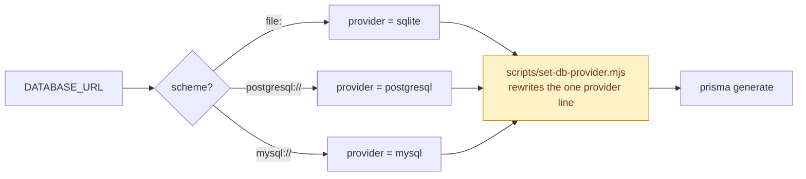

# 🗄 Database Schema

> Source: [`server/prisma/schema.prisma`](../server/prisma/schema.prisma)
> · Seed: [`server/src/seed/`](../server/src/seed/)
> · Browse it: `npm run db:studio`

13 tables. This document explains what each holds, why it is shaped that way,
and the constraints that make the guarantees in the README true.

---

## Contents

1. [Entity relationships](#entity-relationships)
2. [Portability: one schema, two databases](#portability-one-schema-two-databases)
3. [Identity & access](#identity--access)
4. [Geography](#geography)
5. [Pricing configuration](#pricing-configuration)
6. [Orders](#orders)
7. [Audit trails](#audit-trails)
8. [Notifications](#notifications)
9. [Indexes](#indexes)
10. [Referential integrity](#referential-integrity)
11. [Migrations](#migrations)

---

## Entity relationships

```mermaid
erDiagram
    USER ||--o| AGENT_PROFILE : "is a"
    USER ||--o{ REFRESH_TOKEN : "holds"
    USER ||--o{ ADDRESS : "saves"
    USER ||--o{ ORDER : "customer"
    USER ||--o{ ORDER : "createdBy"
    USER ||--o{ TRACKING_EVENT : "actor"
    USER ||--o{ ASSIGNMENT_HISTORY : "assignedBy"
    USER ||--o{ RESCHEDULE_REQUEST : "requestedBy"
    USER ||--o{ NOTIFICATION : "recipient"

    ZONE ||--o{ AREA : "contains"
    ZONE ||--o{ AGENT_PROFILE : "home zone"
    ZONE ||--o{ RATE_CARD : "fromZone"
    ZONE ||--o{ RATE_CARD : "toZone"
    ZONE ||--o{ ORDER : "pickupZone"
    ZONE ||--o{ ORDER : "dropZone"

    ADDRESS ||--o{ ORDER : "pickup"
    ADDRESS ||--o{ ORDER : "drop"

    RATE_CARD ||--o{ ORDER : "priced by"
    AGENT_PROFILE ||--o{ ORDER : "assigned to"
    AGENT_PROFILE ||--o{ ASSIGNMENT_HISTORY : "was assigned"

    ORDER ||--o{ TRACKING_EVENT : "history"
    ORDER ||--o{ ASSIGNMENT_HISTORY : "dispatch audit"
    ORDER ||--o{ RESCHEDULE_REQUEST : "retries"
    ORDER ||--o{ NOTIFICATION : "messages"

    USER {
        string   id PK
        string   email UK
        string   passwordHash
        string   fullName
        string   phone
        string   role "CUSTOMER|AGENT|ADMIN"
        string   companyName
        boolean  isActive
        datetime createdAt
        datetime updatedAt
    }

    AGENT_PROFILE {
        string   id PK
        string   userId FK UK
        string   vehicleType "BIKE|SCOOTER|VAN|TRUCK"
        string   vehicleNumber
        string   zoneId FK
        string   availability "AVAILABLE|BUSY|ON_BREAK|OFFLINE"
        float    currentLat
        float    currentLng
        datetime lastLocationAt
        int      maxConcurrentOrders
        int      activeOrderCount
        int      totalAssigned
        int      totalDelivered
        int      totalFailed
        float    ratingAvg
    }

    ZONE {
        string  id PK
        string  code UK "BLR-S"
        string  name
        string  city
        string  state
        string  description
        float   centerLat
        float   centerLng
        boolean isActive
    }

    AREA {
        string  id PK
        string  pincode UK "the detection key"
        string  name
        string  city
        string  state
        string  zoneId FK
        float   lat
        float   lng
        boolean isActive
    }

    ORDER {
        string   id PK
        string   code UK "SR-7K3M9QX2"
        string   customerId FK
        string   createdById FK
        string   orderType "B2B|B2C"
        string   paymentType "PREPAID|COD"
        float    declaredValue
        string   pickupAddressId FK
        string   dropAddressId FK
        string   pickupZoneId FK
        string   dropZoneId FK
        float    lengthCm
        float    breadthCm
        float    heightCm
        float    actualWeightKg
        float    volumetricWeightKg
        float    chargeableWeightKg
        string   rateCardId FK
        float    baseCharge
        float    weightCharge
        float    handlingFee
        float    fuelSurcharge
        float    codSurcharge
        float    taxAmount
        float    totalCharge
        string   currency
        string   pricingBreakdown "JSON snapshot"
        string   status
        string   agentId FK
        datetime scheduledDate
        datetime pickedUpAt
        datetime deliveredAt
        datetime failedAt
        string   failureReason
        int      attemptCount
        string   cancelReason
        string   notes
        datetime createdAt
        datetime updatedAt
    }

    TRACKING_EVENT {
        string   id PK
        string   orderId FK
        string   fromStatus
        string   toStatus
        string   actorId FK
        string   actorRole
        string   actorName "denormalised"
        string   title
        string   notes
        float    lat
        float    lng
        string   metadata "JSON"
        datetime createdAt
    }
```

---

## Portability: one schema, two databases

SQLite locally, PostgreSQL in production, from the **same schema file**.



Prisma cannot take `datasource.provider` from an environment variable, so
[`set-db-provider.mjs`](../server/scripts/set-db-provider.mjs) rewrites that one
line before generation. It is wired into **every** `db:*` script via
[`prisma.mjs`](../server/scripts/prisma.mjs), so it cannot be forgotten.

### Two consequences of supporting SQLite

| Prisma feature | Why it is avoided | What is used instead |
|---|---|---|
| `enum` | Unsupported on SQLite | `String` columns, with the canonical values in [`domain/constants.ts`](../server/src/domain/constants.ts) and enforcement at the API boundary by Zod |
| `Json` | Unsupported on SQLite | JSON-encoded `String`, packed/unpacked by [`utils/serialize.ts`](../server/src/utils/serialize.ts) |

This is a deliberate trade: the database gives up a little type enforcement, and
in exchange a reviewer clones the repo and is running in 60 seconds with no
Docker and no database server. The application-level enforcement is genuinely
strict — nothing reaches Prisma without passing a Zod schema derived from the
same constant list.

> **Money** is stored as `Float`, but **all arithmetic runs on integer paise**
> and only converts back at the boundary. See
> [`utils/money.ts`](../server/src/utils/money.ts). A `Decimal` column would be
> stricter; it is also unsupported on SQLite, and disciplined integer arithmetic
> gives the same correctness with the tests to prove it.

---

## Identity & access

### `User`

One table backs all three personas; `role` drives every authorisation decision.

| Column | Notes |
|---|---|
| `email` | `UNIQUE`, lower-cased on write |
| `passwordHash` | bcrypt, cost from `BCRYPT_ROUNDS` |
| `role` | `CUSTOMER` \| `AGENT` \| `ADMIN`. Self-registration always yields `CUSTOMER`. |
| `isActive` | Soft delete — deactivated users cannot authenticate, and the dispatcher filters them out |
| `companyName` | Flags accounts that typically ship on B2B contract rates |

### `RefreshToken`

| Column | Notes |
|---|---|
| `tokenHash` | `UNIQUE`. **SHA-256 of the token**, never the token — a dump of this table cannot mint a session. |
| `expiresAt` · `revokedAt` | Rotation sets `revokedAt` on the presented row and inserts a fresh one |
| `userAgent` | Truncated to 250 chars, for session review |

### `AgentProfile`

The operational state the dispatcher scores against.

| Column | Feeds |
|---|---|
| `availability` | Hard eligibility filter. Flips to `BUSY`/`AVAILABLE` **automatically** with capacity. |
| `currentLat` · `currentLng` · `lastLocationAt` | The proximity signal. Updated by `POST /agents/me/location`. |
| `zoneId` | The zone-match signal |
| `vehicleType` | Weight-capacity filter (`BIKE` 15 kg … `TRUCK` 5000 kg) |
| `maxConcurrentOrders` · `activeOrderCount` | Capacity filter and the workload signal |
| `totalDelivered` · `totalFailed` · `ratingAvg` | The performance signal |

`activeOrderCount` is maintained **inside the same transaction** as each status
change, so it can never drift from reality.

---

## Geography

### `Zone`

A pricing/operations region. Rate cards are written against these.
`code` is `UNIQUE` (e.g. `BLR-S`). `centerLat`/`centerLng` are the fallback
position for distance maths, never used for detection.

### `Area` — the zone-detection lookup table

**`pincode` is `UNIQUE`**, which is the entire design: detection is one indexed
equality lookup, `O(1)`, identical on SQLite and PostgreSQL.

`lat`/`lng` are the area centroid, used to place an address that arrives without
its own coordinates.

### `Address`

Orders hold **immutable snapshots**, not references to a customer's saved
address book. `isSaved` distinguishes the two:

| `isSaved` | Meaning |
|---|---|
| `true` | A reusable entry in a customer's address book |
| `false` | A per-order snapshot, written once at booking |

> Editing a saved address must never rewrite where a parcel was actually
> delivered last month.

---

## Pricing configuration

### `PricingSetting` — singleton, `id = "default"`

`volumetricDivisor` · `weightRoundingKg` · `minChargeableWeightKg` · `currency`.
Materialised with documented defaults on first read if an operator has never
touched it.

### `RateCard`

| Column | Notes |
|---|---|
| `orderType` + `scope` | The 2 × 2 matrix |
| `fromZoneId` + `toZoneId` | Both `null` = generic. Both set = a **lane override** that beats the generic card. |
| `baseWeightKg` / `basePrice` | The base slab |
| `incrementalWeightKg` / `incrementalPrice` | Every slab above it |
| `handlingFee` · `fuelSurchargePct` · `gstPct` | Add-ons |
| `priority` | Higher wins on a tie. Lane cards seed at `100`, generic at `50`. |
| `effectiveFrom` / `effectiveTo` | Time-boxing for promotional cards |
| `isActive` | Cards that have priced real orders are **archived, not deleted** |

### `CodRule`

Per order type: `max(flatFee, percentOfValue% × declaredValue)` clamped into
`[minFee, maxFee]`. `maxFee = null` means no ceiling.

---

## Orders

`Order` is the centre of the schema and carries three distinct kinds of data.

### 1 · The shipment as booked

`orderType`, `paymentType`, `declaredValue`, the two address snapshots, the two
detected zones, and the raw package measurements.

### 2 · A frozen pricing snapshot

Every charge component is a **column**, and the complete `Quote` object is
serialised into `pricingBreakdown`.

```
baseCharge · weightCharge · handlingFee · fuelSurcharge
codSurcharge · taxAmount · totalCharge · currency
volumetricWeightKg · chargeableWeightKg · rateCardId
```

> This is what makes an invoice stable. Editing a rate card changes tomorrow's
> quotes; it cannot restate an order already placed. The columns support
> aggregation (revenue by zone, average order value) without parsing JSON, while
> `pricingBreakdown` preserves the per-line arithmetic for the UI.

### 3 · Lifecycle state

`status`, `agentId`, `scheduledDate`, and the milestone timestamps
`pickedUpAt` / `deliveredAt` / `failedAt`, plus `attemptCount`, `failureReason`
and `cancelReason`.

`code` is the public tracking number (`SR-7K3M9QX2`), generated from a
Crockford-style alphabet with `I`, `L`, `O` and `U` removed — so a customer
reading it down the phone cannot confuse it with `1` or `0`.

---

## Audit trails

### `TrackingEvent` — append-only

| Column | Purpose |
|---|---|
| `fromStatus` → `toStatus` | **What** changed (`fromStatus` is `null` on creation) |
| `actorId` · `actorRole` · `actorName` | **Who** did it |
| `createdAt` | **When** |
| `notes` · `metadata` | **Why** — including `{ override: true, bypassedTransition: "PENDING -> DELIVERED" }` on an admin override |
| `lat` · `lng` | Where the agent was, when they reported it |

Append-only **by construction**: the tracking module exposes only `append` and
read helpers, no route maps to a mutation, and every row is written inside the
same transaction as the status change it records.

> **`actorName` is denormalised on purpose.** If an account is renamed or
> deleted, the history must still read the way it read on the day. A join would
> quietly rewrite the past — the opposite of what an audit log is for.

### `AssignmentHistory`

| Column | Purpose |
|---|---|
| `mode` | `AUTO` \| `MANUAL` \| `REASSIGN` |
| `reason` | The engine's human-readable verdict |
| `distanceKm` · `score` | The numbers that justified it |
| `candidateSnapshot` | JSON: the ranked shortlist at decision time |
| `unassignedAt` | Set when the agent is released, so a full custody chain is recoverable |

### `RescheduleRequest`

`requestedById`, `previousDate`, `newDate`, `reason`, `attemptNumber` — captured
before the status moves, so a reschedule is a record even if the subsequent
dispatch finds nobody.

---

## Notifications

The outbox. Rows are written **before** dispatch is attempted.

| Column | Notes |
|---|---|
| `channel` | `EMAIL` \| `SMS` |
| `recipient` | The address or number actually used |
| `subject` · `body` · `html` | The fully rendered message — which is what makes the flow demonstrable with no provider credentials |
| `status` | `QUEUED` → `SENT` \| `FAILED` \| `SKIPPED` |
| `provider` · `providerMessageId` | `SMTP` / `TWILIO` / `CONSOLE`, and the provider's id |
| `error` · `attempts` | The exact provider error, retryable from the admin console |

---

## Indexes

| Table | Index | Serves |
|---|---|---|
| `User` | `email` (unique) · `role` · `createdAt` | Login, role filters |
| `RefreshToken` | `tokenHash` (unique) · `userId` · `expiresAt` | Refresh lookup, revocation |
| `AgentProfile` | `userId` (unique) · `availability` · `zoneId` | Dispatch candidate fetch |
| `Zone` | `code` (unique) · `isActive` | |
| `Area` | **`pincode` (unique)** · `zoneId` · `city` | ⭐ Zone detection |
| `Address` | `userId` · `pincode` | Address book, search |
| `RateCard` | `(orderType, scope, isActive)` · `(fromZoneId, toZoneId)` | ⭐ Card resolution |
| `CodRule` | `(orderType, isActive)` | |
| `Order` | `status` · `customerId` · `agentId` · `pickupZoneId` · `dropZoneId` · `createdAt` | ⭐ Every admin filter in the brief |
| `TrackingEvent` | `(orderId, createdAt)` · `toStatus` | Timeline, activity feed |
| `AssignmentHistory` | `orderId` · `agentId` | Audit |
| `Notification` | `(userId, createdAt)` · `orderId` · `status` | Outbox, retry sweep |

The `Order` index set is chosen directly from the brief's requirement that an
admin can "filter by status/zone/agent".

---

## Referential integrity

| Relation | On delete | Why |
|---|---|---|
| `AgentProfile → User` | `Cascade` | The profile is meaningless without the account |
| `RefreshToken → User` | `Cascade` | Sessions die with the user |
| `Area → Zone` | `Cascade` | An area cannot exist without its zone |
| `AgentProfile → Zone` | `SetNull` | An agent survives their zone being removed |
| `TrackingEvent → Order` | `Cascade` | History belongs to its order |
| `TrackingEvent → User` | `SetNull` | ⭐ **The event survives the actor** — `actorName` keeps it readable |
| `Order → Zone`, `Order → RateCard` | *restrict* (default) | Deleting a referenced zone or card is refused; the API deactivates instead and says so |

Two API-level guards back this up:

- `DELETE /api/zones/:id` **deactivates** the zone if any order references it;
- `DELETE /api/pricing/rate-cards/:id` **archives** the card if it has priced
  any order, and returns a message explaining why.

---

## Migrations

Development and CI use `prisma db push`, which is the right tool while the
schema is still moving:

```bash
npm run db:push      # sync the schema
npm run db:reset     # wipe + re-seed
npm run db:studio    # browse
```

For a production history, switch to migrations:

```bash
npm run db:migrate            # create + apply, dev
npm run db:deploy             # apply committed migrations, prod
```

Then set `BOOTSTRAP_DB=false` so the boot sequence stops calling `db push` and
your migration history becomes authoritative
([`bootstrap.ts`](../server/src/bootstrap.ts)).

---

## Related

- 📄 [RATE_ENGINE.md](RATE_ENGINE.md) — how the pricing tables are consumed
- 📄 [AUTO_ASSIGNMENT.md](AUTO_ASSIGNMENT.md) — how `AgentProfile` is scored
- 📄 [ARCHITECTURE.md](ARCHITECTURE.md) — transactional boundaries
- 📄 [API.md](API.md) — the payloads these models produce
