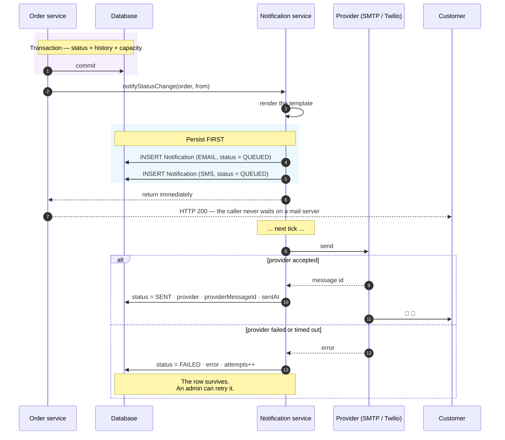
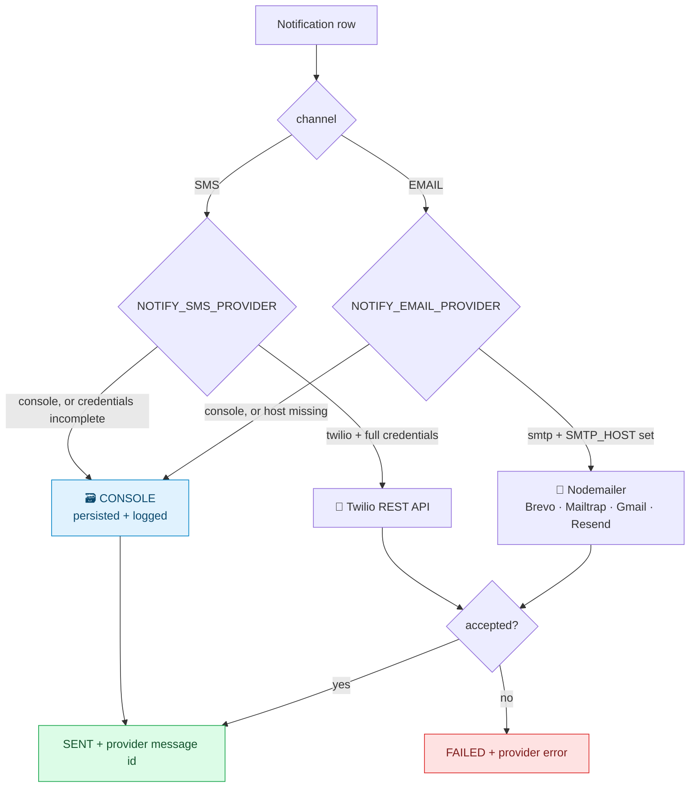

# 🔔 Notifications

> Source: [`server/src/services/notifications/`](../server/src/services/notifications/)
> — [`index.ts`](../server/src/services/notifications/index.ts) (the outbox) ·
> [`transports.ts`](../server/src/services/notifications/transports.ts) ·
> [`templates.ts`](../server/src/services/notifications/templates.ts)

E-mail on **every** status change, as the brief requires, plus SMS at the
moments a customer actually needs to act on — delivered through a transactional
outbox.

---

## Contents

1. [The outbox pattern](#the-outbox-pattern)
2. [What is sent, and when](#what-is-sent-and-when)
3. [Transports](#transports)
4. [Why `console` is a feature, not a stub](#why-console-is-a-feature-not-a-stub)
5. [Templates](#templates)
6. [Delivery guarantees](#delivery-guarantees)
7. [Observability](#observability)
8. [Adding a notification](#adding-a-notification)

---

## The outbox pattern



Two properties fall out of writing the rows **before** dispatching:

**Nothing is lost.** If SMTP is down, the row persists with status `FAILED` and
the exact provider error, ready to be retried.

**Nothing blocks.** Dispatch is fire-and-forget from the caller's point of view,
so a slow mail server can never make `PATCH /orders/:id/status` time out — the
status change is already committed.

> **Why dispatch sits outside the database transaction:** a mail server must
> never be able to roll back a delivery. Only the *sending* is out of band; the
> record of what should be sent is inside.

---

## What is sent, and when

| Event | 📧 E-mail | 📱 SMS | Template |
|---|:---:|:---:|---|
| Account created | ✅ | — | `welcomeTemplate` |
| Order created | ✅ | ✅ | `orderCreatedTemplate` |
| Agent assigned | ✅ | ✅ | `agentAssignedTemplate` |
| Picked up | ✅ | — | `statusChangedTemplate` |
| In transit | ✅ | — | `statusChangedTemplate` |
| Out for delivery | ✅ | ✅ | `statusChangedTemplate` |
| Delivered | ✅ | ✅ | `statusChangedTemplate` |
| **Delivery failed** | ✅ | ✅ | `deliveryFailedTemplate` |
| Rescheduled | ✅ | ✅ | `rescheduledTemplate` |
| Cancelled | ✅ | ✅ | `statusChangedTemplate` |

**E-mail fires on every status transition** — the brief's requirement, taken
literally. `notifyStatusChange` is called from the single funnel in
`orderService`, so a new status is covered automatically.

**SMS is deliberately narrower.** Texting someone that their parcel moved from
*picked up* to *in transit* is noise. The SMS list is exactly the moments where
the customer may need to do something: an agent is coming, it is arriving today,
it arrived, it failed, it was rescheduled, it was cancelled.

```ts
const smsWorthy: OrderStatus[] = [
  'ASSIGNED', 'OUT_FOR_DELIVERY', 'DELIVERED',
  'FAILED', 'RESCHEDULED', 'CANCELLED',
];
```

---

## Transports



### E-mail — SMTP via Nodemailer

Any SMTP server. Free options that work out of the box are listed in
[DEPLOYMENT.md](DEPLOYMENT.md#wiring-real-notifications).

> **Render free-tier note:** use a provider that supports port `2525` (Brevo
> and Mailtrap do). Render free web services block outbound SMTP ports `25`,
> `465`, and `587`; the checked-in Render blueprint therefore defaults to
> `2525`.

The transporter is created lazily and cached. If `NOTIFY_EMAIL_PROVIDER=smtp`
but `SMTP_HOST` is empty, the service **logs a warning and falls back to
console** rather than throwing — a misconfiguration should degrade, not take the
API down.

### SMS — Twilio over plain REST

Called with `fetch` against
`https://api.twilio.com/2010-04-01/Accounts/{sid}/Messages.json` rather than the
official SDK. One HTTP POST does not justify a multi-megabyte dependency, and it
keeps the cold-start time of a free-tier host down.

Incomplete credentials fall back to console, with a warning.

---

## Why `console` is a feature, not a stub

This is a deliberate product decision.

A reviewer cloning this repository has no SMTP credentials and no Twilio
account. **An assignment that only demonstrates notifications when secrets are
present demonstrates nothing** — you would be reading code and taking it on
trust.

With `NOTIFY_*_PROVIDER=console`, every message is still:

- **rendered** from the real template, with the real order data;
- **persisted** to the `Notification` table with `provider = "CONSOLE"`;
- **logged** to the server console;
- **surfaced in the in-app outbox**, where clicking a message shows the actual
  branded HTML e-mail that would have gone out.

The entire pipeline — trigger, template, rendering, persistence, status
tracking, the admin view — is exercised and observable. Point the same code at
SMTP or Twilio and real messages send, with **no other change**.

```
Admin → Notification outbox
┌──────────────────────────────────────────────────────────────────┐
│ 📧  SR-JX1BA5P7 — Out for delivery            [SENT] [CONSOLE]   │
│     Order SR-JX1BA5P7 is now Out for delivery. On the final…     │
│     ananya.rao@example.com · SR-JX1BA5P7 · 4 minutes ago         │
├──────────────────────────────────────────────────────────────────┤
│ 📱  SMS to +919845012345                      [SENT] [CONSOLE]   │
│     SwiftRoute SR-JX1BA5P7: Out for delivery. http://…/track/…   │
└──────────────────────────────────────────────────────────────────┘
   ↑ clicking opens the fully rendered HTML e-mail
```

---

## Templates

All copy lives in
[`templates.ts`](../server/src/services/notifications/templates.ts), so tone
stays consistent and a product person can edit wording without reading any
business logic.

Each template returns four renderings:

```ts
interface RenderedMessage {
  subject: string;  // e-mail subject
  html:    string;  // branded HTML body
  text:    string;  // plain-text fallback
  sms:     string;  // short form, kept inside one or two segments
}
```

### The HTML shell

Deliberately old-school: **table-based layout, inline styles, no external
assets**. That is the only thing every mail client renders reliably — Outlook in
particular ignores most modern CSS. The shell carries the SwiftRoute gradient
header, a status-coloured eyebrow badge, a details table and a single call to
action.

Status accent colours come from the same tone map the UI uses, so a "failed"
e-mail is the same rose as the failed badge in the app.

### The failure template earns its own design

`deliveryFailedTemplate` is the only one that asks the customer to *do*
something, so it:

- leads with the reason the agent gave;
- reassures that the parcel is safe;
- deep-links straight into the reschedule flow
  (`/track/{code}?action=reschedule`);
- states the return-to-sender window in the footer.

---

## Delivery guarantees

**At-least-once, best-effort.**

| Guarantee | Provided? | Notes |
|---|:---:|---|
| The message is *recorded* | ✅ always | The row is written before any provider call |
| The message is *attempted* | ✅ | On the next tick after commit |
| Delivery is retried on failure | ✅ manual | `POST /api/notifications/retry` re-dispatches every `FAILED` row |
| Exactly-once delivery | ❌ | A crash between provider-accept and row-update could duplicate |
| Ordering | ❌ | Messages for one order are near-simultaneous |

At-least-once is the right trade for customer notifications: a duplicate
"out for delivery" text is a nuisance, a missing one is a support ticket.

> **At scale** this becomes a real queue (BullMQ/Redis) with exponential backoff
> and a dead-letter queue. The outbox table already *is* the queue — only the
> consumer moves. See [ARCHITECTURE.md](ARCHITECTURE.md#what-would-change-at-scale).

---

## Observability

| Endpoint | Who | What |
|---|---|---|
| `GET /api/notifications` | scoped | Customers see their own; admins see everything. Filter by `orderId`, `channel`, `status`. |
| `GET /api/notifications/:id` | scoped | The full message, HTML included |
| `GET /api/notifications/transports` | 🛡️ admin | What is wired up **plus a live SMTP handshake** — verify credentials without sending |
| `POST /api/notifications/retry` | 🛡️ admin | Re-dispatch every `FAILED` message |
| `GET /api/health` | 🌐 | Includes the transport summary |

The admin **Notifications** screen renders all of this, including a banner that
states plainly whether the deployment is sending for real or running in outbox
mode.

---

## Adding a notification

Three steps.

**1 · Write the template** in `templates.ts`:

```ts
export function pickupDelayedTemplate(order: OrderSummary): RenderedMessage {
  const url = trackingUrl(order.code);
  return {
    subject: `${order.code} — pickup running late`,
    html: shell({
      accent: TONE_HEX.amber,
      eyebrow: 'Pickup delayed',
      heading: 'Your pickup is running a little late',
      body: p('Our agent has been held up. We will collect within the hour.'),
      ctaLabel: 'View live tracking',
      ctaUrl: url,
    }),
    text: `Pickup for ${order.code} is delayed. Track: ${url}`,
    sms: `SwiftRoute ${order.code}: pickup delayed. ${url}`,
  };
}
```

**2 · Queue it** from `index.ts`:

```ts
export async function notifyPickupDelayed(order: OrderForNotification) {
  await queue({
    message: pickupDelayedTemplate(summarise(order)),
    recipient: recipientOf(order),
    orderId: order.id,
    includeSms: true,
  });
}
```

**3 · Call it** from the service that knows the event happened. Nothing else
needs to change — persistence, dispatch, retry and the admin view all work
automatically.

---

## Related

- 📄 [ARCHITECTURE.md](ARCHITECTURE.md#the-transactional-core) — why dispatch is outside the transaction
- 📄 [DEPLOYMENT.md](DEPLOYMENT.md#wiring-real-notifications) — provider setup
- 📄 [DATABASE.md](DATABASE.md#notifications) — the `Notification` model
- 📄 [API.md](API.md#notifications) — the endpoints
