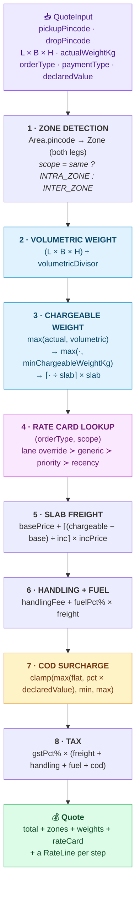
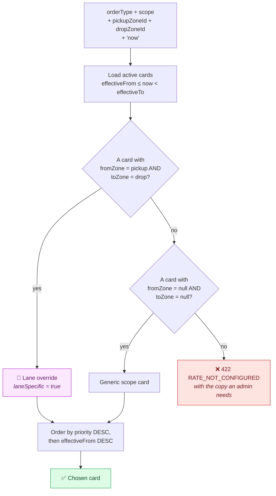
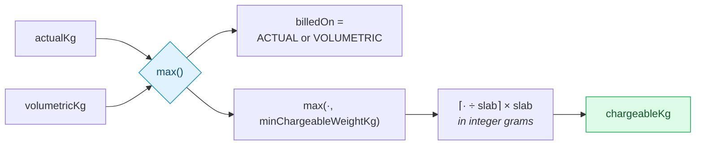
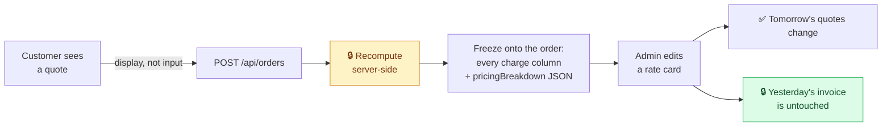

# 🧮 The Rate Calculation Engine

> Source: [`server/src/services/rateEngine.ts`](../server/src/services/rateEngine.ts)
> · Tests: [`rateEngine.test.ts`](../server/src/services/rateEngine.test.ts)
> · Zone detection: [`zoneService.ts`](../server/src/services/zoneService.ts)

The engine is a **pure function of *(shipment input) × (admin configuration)***.
There is not a single magic number in the pricing path: divisors, slab sizes,
prices, surcharge percentages and COD rules all come from database tables an
administrator edits in the UI.

---

## Contents

1. [The eight steps](#the-eight-steps)
2. [Configuration surface](#configuration-surface)
3. [Zone detection](#zone-detection)
4. [Rate-card resolution](#rate-card-resolution)
5. [Weight maths](#weight-maths)
6. [Charge maths](#charge-maths)
7. [Worked examples](#worked-examples)
8. [Money precision](#money-precision)
9. [Price immutability](#price-immutability)
10. [Failure modes](#failure-modes)
11. [Evolving zone detection](#evolving-zone-detection)

---

## The eight steps



---

## Configuration surface

Everything the engine reads, and where an admin edits it.

### `PricingSetting` — a singleton (`id = "default"`)

| Field | Default | Meaning |
|---|---:|---|
| `volumetricDivisor` | `5000` | The divisor in `(L × B × H) ÷ d`. Encodes how much space a kilogram of "average" cargo occupies. 5000 is the IATA/courier standard for road and air express; **lower it to bill bulky freight harder**. |
| `weightRoundingKg` | `0.5` | Chargeable weight rounds **up** to the next multiple of this. |
| `minChargeableWeightKg` | `0.5` | Floor, so a 50 g envelope still covers handling cost. |
| `currency` | `INR` | Display currency. |

*Admin UI:* **Pricing → Weight settings**, which also renders a live preview of
what the current divisor does to four common box sizes.

### `RateCard` — the 2 × 2 matrix, plus lane overrides

| Field | Meaning |
|---|---|
| `orderType` | `B2B` \| `B2C` |
| `scope` | `INTRA_ZONE` \| `INTER_ZONE` |
| `fromZoneId` / `toZoneId` | Both `null` = a generic card for the whole scope. Both set = a **lane override** for that exact zone pair. |
| `baseWeightKg` / `basePrice` | The base price covers everything up to the base weight. |
| `incrementalWeightKg` / `incrementalPrice` | Every additional slab (or part thereof). |
| `handlingFee` | Flat per-shipment fee. |
| `fuelSurchargePct` | Percentage of the freight subtotal. |
| `gstPct` | Percentage applied to the whole taxable value. |
| `priority` | Higher wins when several cards match. Seeded lane cards use `100`, generic ones `50`. |
| `effectiveFrom` / `effectiveTo` | Time-boxing, so a promotional card can be published without deleting the standing one. |
| `isActive` | Soft switch. |

*Admin UI:* **Pricing → Rate cards**.

### `CodRule` — per order type

| Field | Meaning |
|---|---|
| `flatFee` | The floor component. |
| `percentOfValue` | Percentage of `declaredValue`. |
| `minFee` / `maxFee` | The published band the result is clamped into. `maxFee = null` means no ceiling. |

*Admin UI:* **Pricing → COD surcharge**, which renders worked examples at ₹500,
₹5,000 and ₹50,000 so the shape of the rule is obvious at a glance.

### The seeded configuration

| Card | Type | Scope | Base | Per slab | Handling | Fuel | GST |
|---|---|---|---|---|---:|---:|---:|
| B2C Local — standard | B2C | intra | ₹49 / 0.5 kg | ₹22 / 0.5 kg | — | 6% | 18% |
| B2C Regional — standard | B2C | inter | ₹79 / 0.5 kg | ₹38 / 0.5 kg | ₹10 | 8% | 18% |
| B2B Local — contract | B2B | intra | ₹180 / 5 kg | ₹18 / 1 kg | ₹25 | 6% | 18% |
| B2B Regional — contract | B2B | inter | ₹320 / 5 kg | ₹28 / 1 kg | ₹40 | 8% | 18% |
| 🎯 B2B BLR-E → MUM-W express | B2B | inter *(lane)* | ₹460 / 5 kg | ₹34 / 1 kg | ₹60 | 10% | 18% |
| 🎯 B2C BLR-S → HYD-C promo | B2C | inter *(lane)* | ₹69 / 1 kg | ₹32 / 0.5 kg | — | 8% | 18% |

> B2C pays more per kilo than B2B but starts from a lower entry slab — a
> business shipping volume negotiates a lower rate in exchange for a higher
> commitment, which is exactly how real freight contracts read.

| COD rule | Flat | % of value | Min | Max |
|---|---:|---:|---:|---:|
| B2C | ₹40 | 1.5% | ₹40 | ₹500 |
| B2B | ₹90 | 1.0% | ₹90 | ₹2,500 |

---

## Zone detection

**Step 1.** Both legs resolve through `Area.pincode` (a `UNIQUE` column) to a
`Zone`.

```
560034 ──┐
560011 ──┼──► Area rows ──► Zone "BLR-S" (South Bengaluru)
560078 ──┘
```

```ts
scope = pickupZone.id === dropZone.id ? 'INTRA_ZONE' : 'INTER_ZONE';
```

That single boolean selects between the two halves of every rate-card set an
admin configures.

**Why a lookup table rather than geometry** is covered in the
[README](../README.md#-zone-detection) and revisited in
[Evolving zone detection](#evolving-zone-detection) below.

Detection also produces the **best available coordinates** for each leg,
degrading `address fix → area centroid → zone centroid`. These are never used
for pricing — only by the dispatcher.

---

## Rate-card resolution



**Precedence, highest first:**

1. A card naming this **exact zone pair** (`fromZoneId = A`, `toZoneId = B`).
2. A **generic** card for the scope (`fromZoneId = null`, `toZoneId = null`).

Ties break on `priority`, then on the most recently effective card.

> `GET /api/pricing/resolve?orderType=&scope=&fromZoneId=&toZoneId=` answers
> "which card would price this lane, and why?" without creating anything. The
> admin UI surfaces the same thing on every quote as a `laneSpecific` badge.

---

## Weight maths

### Volumetric weight

$$W_{vol} = \frac{L \times B \times H}{d}$$

```ts
volumetricWeight(30, 20, 15, 5000)  // 9000 / 5000 = 1.8 kg
volumetricWeight(30, 20, 15, 4000)  //             = 2.25 kg
```

A zero or negative divisor throws rather than returning `Infinity`.

### Chargeable weight



| Input | Volumetric | Billed on | Floor | Slab-rounded |
|---|---|---|---|---|
| 1.20 kg, 30×20×15 | 1.80 | 🔵 volumetric | 1.80 | **2.00** |
| 8.00 kg, 30×20×15 | 1.80 | 🟢 actual | 8.00 | **8.00** |
| 0.05 kg, 5×5×5 | 0.025 | 🟢 actual | 0.50 | **0.50** |
| 1.50 kg, tiny box | 0.10 | 🟢 actual | 1.50 | **1.50** ← *not 2.0* |
| 0.60 kg, tiny box | 0.10 | 🟢 actual | 0.60 | **1.00** |

> ⚠️ **The float trap.** `1.5 / 0.5` evaluates to `2.9999999999999996` in
> IEEE-754, so `Math.ceil` on the raw division would silently bill a whole extra
> slab on an exact boundary. The implementation works in **integer grams**:
> `Math.ceil(1500 / 500) = 3` → `1.5 kg`. This has a named test.

Ties go to `ACTUAL` — if the two weights are equal, nothing about the parcel is
unusually bulky.

---

## Charge maths

### Slab freight

$$\text{freight} = P_{base} + \left\lceil \frac{\max(0,\; W_{ch} - W_{base})}{W_{inc}} \right\rceil \times P_{inc}$$

```ts
freightFor(2.0, { baseWeightKg: 0.5, basePrice: 49, incrementalWeightKg: 0.5, incrementalPrice: 22 })
// → { baseCharge: 49, weightCharge: 66, extraSlabs: 3 }
```

An underweight parcel never produces a negative `weightCharge`.

### COD surcharge

$$\text{cod} = \mathrm{clamp}\big(\max(F_{flat},\; p\% \times V),\; F_{min},\; F_{max}\big)$$

| Declared value | `max(₹40, 1.5%)` | Clamped to ₹40–500 |
|---:|---:|---:|
| ₹500 | `max(40, 7.50)` = 40 | **₹40.00** |
| ₹1,000 | `max(40, 15.00)` = 40 | **₹40.00** |
| ₹4,500 | `max(40, 67.50)` = 67.50 | **₹67.50** |
| ₹50,000 | `max(40, 750.00)` = 750 | **₹500.00** ← capped |

> **Why `max()` and not `sum()`?** The flat fee and the percentage are two
> different risk models. The flat fee is a floor that makes collecting ₹200 in
> cash worth the paperwork. The percentage takes over once the cash a rider
> carries becomes a real theft and reconciliation risk. Adding them would
> double-charge the middle of the range — which is why carriers take the maximum
> and clamp it into a published band.

### Order of operations

```
freight   = baseCharge + weightCharge
subtotal  = freight + handlingFee + fuelSurcharge(freight)
taxable   = subtotal + codSurcharge
tax       = gstPct% × taxable
total     = taxable + tax
```

Fuel is a percentage of **freight only** — it models the cost of moving the
parcel, not of collecting cash for it. GST applies to **everything**, because it
is a tax on the service as invoiced.

---

## Worked examples

### A · B2C intra-zone, COD

`560034 → 560011` · `30 × 20 × 15 cm` · `1.2 kg` · declared `₹4,500`

| # | Step | Working | Amount |
|---|---|---|---:|
| 1 | Zones | BLR-S → BLR-S | `INTRA_ZONE` |
| 2 | Volumetric | `9000 ÷ 5000` | `1.80 kg` |
| 3 | Chargeable | `max(1.2, 1.8)` → slab | `2.00 kg` |
| 4 | Card | generic B2C intra | *B2C Local — standard* |
| 5 | Base | first `0.5 kg` | `₹49.00` |
| 5 | Extra | `⌈1.5 ÷ 0.5⌉ = 3 × ₹22` | `₹66.00` |
| 6 | Fuel | `6% × ₹115.00` | `₹6.90` |
| 7 | COD | `max(40, 1.5% × 4500)` | `₹67.50` |
| 8 | GST | `18% × ₹189.40` | `₹34.09` |
| | **Total** | | **`₹223.49`** |

### B · B2C inter-zone with a lane override, prepaid

`560034 → 500034` (Bengaluru → Hyderabad) · `25 × 18 × 12 cm` · `2.4 kg`

| # | Step | Working | Amount |
|---|---|---|---:|
| 1 | Zones | BLR-S → HYD-C | `INTER_ZONE` |
| 2 | Volumetric | `5400 ÷ 5000` | `1.08 kg` |
| 3 | Chargeable | `max(2.4, 1.08)` → slab | `2.50 kg` |
| 4 | Card | 🎯 **lane override beats the generic card** | *B2C BLR-S → HYD-C promo* |
| 5 | Base | first `1 kg` | `₹69.00` |
| 5 | Extra | `⌈1.5 ÷ 0.5⌉ = 3 × ₹32` | `₹96.00` |
| 6 | Fuel | `8% × ₹165.00` | `₹13.20` |
| 7 | COD | prepaid | `₹0.00` |
| 8 | GST | `18% × ₹178.20` | `₹32.08` |
| | **Total** | | **`₹210.28`** |

Without the lane override this would have used *B2C Regional — standard*
(₹79 base + ₹38/slab), landing meaningfully higher — which is the whole point of
publishing a promotional lane.

### C · B2B, bulky, COD on high value

`560066 → 400053` (Whitefield → Andheri West) · `60 × 45 × 40 cm` · `18 kg` ·
declared `₹80,000`

| # | Step | Working | Amount |
|---|---|---|---:|
| 1 | Zones | BLR-E → MUM-W | `INTER_ZONE` |
| 2 | Volumetric | `108000 ÷ 5000` | `21.60 kg` |
| 3 | Chargeable | `max(18, 21.6)` → slab | 🔵 `22.00 kg` *(volumetric)* |
| 4 | Card | 🎯 lane override | *B2B BLR-E → MUM-W express* |
| 5 | Base | first `5 kg` | `₹460.00` |
| 5 | Extra | `⌈17 ÷ 1⌉ = 17 × ₹34` | `₹578.00` |
| 6 | Handling | flat | `₹60.00` |
| 6 | Fuel | `10% × ₹1,038.00` | `₹103.80` |
| 7 | COD | `max(90, 1% × 80000 = 800)`, capped at ₹2,500 | `₹800.00` |
| 8 | GST | `18% × ₹2,001.80` | `₹360.32` |
| | **Total** | | **`₹2,362.12`** |

This is the case volumetric weight exists for: the parcel weighs 18 kg but
occupies the space of 21.6 kg.

---

## Money precision

Currency is stored in a `Float` column for ergonomics, but **arithmetic is
always performed on integer minor units (paise)**.

```ts
toMinor(49.00)          // 4900
percentOf(189.4, 18)    // 34.09   ← 34.092 rounded at the paisa
sumMoney(0.1, 0.2)      // 0.3     ← not 0.30000000000000004
```

Every intermediate result in the engine snaps back to paise. Accumulating 18%
GST on a float subtotal across five line items is exactly how invoices end up
off by a rupee, and "off by a rupee" is the kind of bug that reaches a customer.

📄 [`server/src/utils/money.ts`](../server/src/utils/money.ts)

---

## Price immutability



Two guarantees follow:

1. **The client cannot set its own price.** The quote endpoint is a convenience;
   `createOrder` recomputes from scratch and ignores anything the client claims.
2. **History is stable.** The complete `Quote` object is serialised onto
   `Order.pricingBreakdown`, so the order detail screen renders the arithmetic
   as it was on the day. Rate cards that have priced real orders are **archived
   rather than deleted** for the same reason (`DELETE /pricing/rate-cards/:id`
   deactivates them and says so).

---

## Failure modes

| Condition | Status | Code | What the operator is told |
|---|---:|---|---|
| Pincode not in any area | `422` | `ZONE_NOT_SERVICEABLE` | *"Pincode 999999 is not mapped to a delivery zone yet. An admin can add it under Zones → Areas."* |
| Area or zone deactivated | `422` | `ZONE_NOT_SERVICEABLE` | same |
| No card for `(orderType, scope)` | `422` | `RATE_NOT_CONFIGURED` | *"No active B2B rate card covers an inter zone shipment on this lane. An admin can create one under Pricing → Rate cards."* |
| `volumetricDivisor ≤ 0` | `422` | `RATE_NOT_CONFIGURED` | *"Volumetric divisor must be greater than zero."* |
| Non-positive dimensions | `422` | `VALIDATION_ERROR` | Field-level messages |
| No COD rule for the order type | — | — | Not an error: the surcharge is waived and the quote line says so explicitly. |

The admin's rate-card screen renders a dashed "No card configured" placeholder
for any empty cell of the 2 × 2 matrix, so a gap is visible before a customer
finds it.

---

## Evolving zone detection

The lookup table is right for this system today. Two things would change it:

**1 · A pincode straddling two zones.** Add a `SubArea` table keyed on
`(pincode, localityName)` and match on the address line, falling back to the
pincode's default zone. This is what carriers actually do — the pincode is the
coarse key and the locality string disambiguates.

**2 · True geographic serviceability.** Move to PostGIS: give `Zone` a
`geography(Polygon)` column and resolve by `ST_Contains(zone.boundary, point)`
against the address's geocoded coordinates, with the pincode table kept as the
fast path and the fallback. That buys correct handling of new developments that
have no pincode yet, at the cost of a geocoding dependency and a
PostgreSQL-only schema.

The engine itself is unaffected either way: `detectZoneByPincode` returns a
`ZoneResolution`, and everything downstream consumes that interface rather than
the mechanism.

---

## Related

- 📄 [SYSTEM_DESIGN.md](SYSTEM_DESIGN.md) — the condensed write-up
- 📄 [AUTO_ASSIGNMENT.md](AUTO_ASSIGNMENT.md) — the dispatcher
- 📄 [DATABASE.md](DATABASE.md) — the pricing tables in detail
- 📄 [API.md](API.md#pricing) — the pricing endpoints
