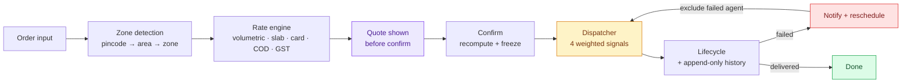

# SwiftRoute — System Design

> Deliverable 4 of the brief. **Word count: 795** (excluding headings and the
> diagram). Covers the rate calculation engine, zone detection, auto-assignment
> logic and failed-delivery handling.

---

## Rate calculation engine

The engine is a pure function of *(shipment input) × (admin configuration)*.
Three tables hold every number it reads — `PricingSetting` (a singleton holding
the volumetric divisor, slab size and minimum weight), `RateCard` and `CodRule` —
so there is no constant anywhere in the pricing path. An operator changes a
divisor in the UI and the very next quote reflects it.

Pricing runs in eight steps. Zone detection resolves both legs and yields a
scope of `INTRA_ZONE` or `INTER_ZONE`. Volumetric weight is `(L × B × H) ÷
divisor`, defaulting to the courier-standard 5000. Chargeable weight is the
greater of actual and volumetric — a van's scarce resources are payload and
space, and billing only on the scale lets a cubic metre of polystyrene travel
free while stealing twenty parcels' worth of space — then floored and rounded
**up** to the next slab. Rate-card resolution matches on
`(orderType, scope)`, with a card naming this exact zone pair taking precedence
over the generic one and `priority` breaking further ties. Freight is
`basePrice + ⌈(chargeable − baseWeight) ÷ slab⌉ × slabPrice`. A flat handling
fee and a percentage fuel surcharge follow. COD adds
`clamp(max(flatFee, pct × declaredValue), minFee, maxFee)` — the *maximum*, not
the sum, because the flat fee is a floor that makes small cash collections worth
handling while the percentage takes over once the cash carried becomes a real
risk. GST applies to the total.

Two details matter for correctness. Arithmetic runs on integer paise, converted
back only at the boundary, because accumulating 18% GST on a float subtotal is
how invoices end up off by a rupee. Slab rounding works in integer grams,
because `1.5 / 0.5` is `2.9999999999999996` in IEEE-754, so a naive `ceil`
would silently bill an extra slab on an exact boundary.

Each step emits a `RateLine` carrying its own formula, so the customer's quote,
the stored invoice and the admin's explanation are literally the same object.
The quote is recomputed server-side on confirm — a price shown in a browser is a
display, never an input — and the result is then frozen onto the order, so
editing a card tomorrow cannot restate yesterday's invoice.

## Zone detection

Detection is a serviceability question, and SwiftRoute answers it the way real
3PL networks do: a `pincode → Area → Zone` lookup table that operations staff
own. `Area.pincode` is `UNIQUE`, so detection is a single indexed equality
lookup rather than a point-in-polygon test, and the identical code runs on
SQLite and PostgreSQL without a spatial extension. Onboarding a locality is a
dropdown, not a GIS task. Coordinates are still carried on every area and zone,
but only as fallback positions for the distance maths, never for detection. An
unmapped pincode fails with an actionable `ZONE_NOT_SERVICEABLE` rather than
guessing. A pincode straddling two zones would need a sub-area rule; the
migration path to polygons is documented.

## Auto-assignment

Dispatch is a ranking problem. "Nearest" alone hands six parcels to the rider
outside the warehouse while an idle rider two kilometres away does nothing.

Hard filters run first: account active, `availability = AVAILABLE`,
`activeOrderCount < maxConcurrentOrders`, the vehicle class can physically carry
the chargeable weight, and — for a retry — the agent whose attempt just failed
is excluded. Survivors are located, degrading gracefully from a live GPS fix to
the home-zone centroid to unlocatable.

Each is then scored on four signals normalised to `[0,1]` and combined with
operator-tunable weights that are re-normalised to sum to one: proximity
(`0.50`), zone familiarity (`0.25`, full credit for the pickup zone and partial
for the drop zone), spare capacity (`0.15`) and delivery record (`0.10`, with
new agents given a neutral score rather than a cold-start penalty). Highest
score wins; ties break on distance, then load. If the radius filter empties the
shortlist the search widens once and flags the decision, so an order is never
silently stranded in a thin-coverage zone.

The complete ranked shortlist — every signal, every rejection reason — is
persisted on `AssignmentHistory` and rendered in the admin UI, because an
auto-assigner that is a black box is impossible to trust or debug.

## Failed-delivery handling

An agent marking `FAILED` must supply a reason. In one transaction the order is
flagged, `attemptCount` increments, the agent is released (freeing capacity, and
flipping them back from `BUSY` if they were saturated) and detached, and an
immutable `TrackingEvent` records who and why. The customer is then notified
with a reschedule call-to-action.

Rescheduling captures a `RescheduleRequest` — requester, previous date, new
date, reason, attempt number — moves the order to `RESCHEDULED`, and re-runs the
dispatcher **excluding the agent who just failed**, so the retry gets a fresh
pair of hands. If nobody is free the order rests in `RESCHEDULED` for manual
assignment; the customer's request is never lost.

---

